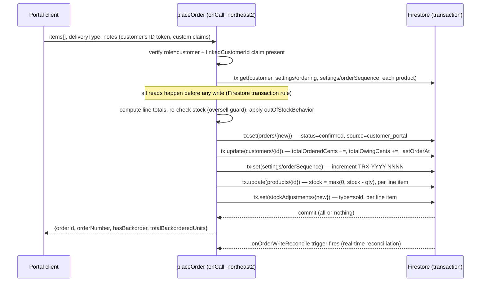
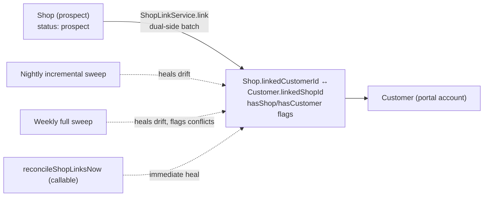
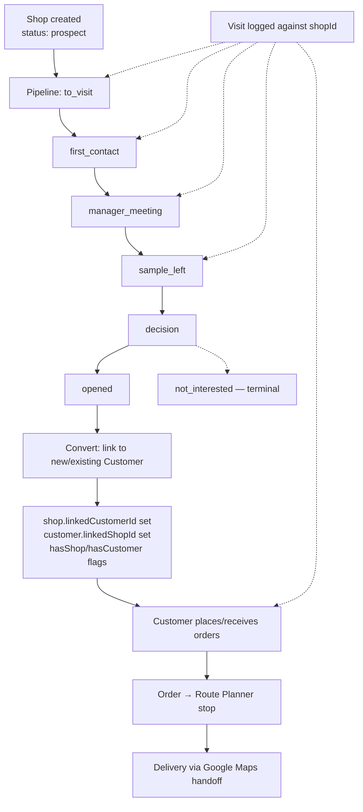

# Tropx Architecture & Engineering Reference

Internal engineering documentation for maintainers. Grounded in the current
code, `firestore.rules`, `functions/src/index.ts`, and the project's commit
history. Where something could not be verified in code or commits, it is
marked **UNVERIFIED**.

## Table of Contents

1. [System Overview](#1-system-overview)
2. [Architecture](#2-architecture)
3. [Data Model](#3-data-model)
4. [Field-Operations Lifecycle](#4-field-operations-lifecycle)
5. [Invariants and Why They Exist](#5-invariants-and-why-they-exist)
6. [Cloud Functions](#6-cloud-functions)
7. [Security Model](#7-security-model)
8. [Operational Concerns](#8-operational-concerns)
9. [Known Gaps and Deferred Work](#9-known-gaps-and-deferred-work)
10. [Decision Log](#10-decision-log)

---

## 1. System Overview

Tropx is a B2B wholesale platform serving a single tenant today
(`tenantId: 1`) but built as if it will serve 1000+ stores and multiple
warehouses, because that is the actual target scale. It is one Angular SPA
with three route trees sharing one codebase and one Firebase backend:

- **`public/`** — unauthenticated marketing site, request-access, login.
- **`portal/`** — the customer-facing storefront (catalog, cart, orders,
  payments, returns), gated by `PortalAuthGuard`.
- **`admin/`** — the staff back-office (orders, customers, products,
  purchasing, field ops, dashboards), gated by `authGuard` + `roleGuard`.

Major subsystems, in the order they were actually built (see commit
history):

| Phase | Subsystem | What it does |
|---|---|---|
| 0 | Auth + core CRUD | Users, roles, products, customers, categories/brands/service areas |
| 1 | Transactional core | Orders, payments, returns, invoicing, stock auto-management |
| 2 | Customer portal | Self-service catalog/cart/orders/returns/payments for customers |
| — | Notifications | Admin alerts + customer transactional email (Resend), abandoned-cart nurture |
| — | Storefront/CMS | `settings/content`, `settings/storefront` — banners, gallery, popular products |
| — | Reconciliation | Server-side recompute of denormalized customer counters, drift detection |
| — | Purchasing | Suppliers, purchase orders, goods receipt, ATP visibility |
| 3 | Shop entity + linking | Shops as prospects/customers, dual-side link, health stamping |
| 4 | Pipeline | Prospect pipeline board, stuck-stamping, conversion |
| 5 | Route mapping | Field map, route optimization, Google Maps handoff |
| 6 | Money-out | Expenses, bills tied to purchase orders, money-out dashboard |

Zoho Books remains the official accounting ledger. The portal owns
**operations** — orders, payments, expenses, bills — not double-entry
accounting or tax-invoice numbering. See [§9](#9-known-gaps-and-deferred-work).

---

## 2. Architecture

### 2.1 Stack

| Layer | Technology |
|---|---|
| Frontend | Angular 20.3, standalone components, zoneless change detection (`provideZonelessChangeDetection()`), signals-based state |
| Backend | Firebase: Firestore (named databases, **not** `(default)`), Auth (custom claims), Storage, Cloud Functions v2 (Node, single file) |
| Hosting | **Netlify** — not Firebase Hosting. `firebase.json` has no `hosting` key; `src/_redirects` handles SPA routing on Netlify |
| Email | Resend, via Cloud Functions secrets (`RESEND_API_KEY`, `FROM_EMAIL`) |
| Maps | Leaflet + OpenStreetMap for display; Google Maps only for the free navigation handoff |
| Client-side PDF | `html2pdf.js` for invoices, POs, bills |

Firestore uses **named databases** (`tropx-dev`, `tropx-prod`), not the
default database — a Firebase quirk that shaped several early bugs (see
[§10](#10-decision-log)). `firebase.json` targets `tropx-dev`;
`firebase.prod.json` (used via `--config`) targets `tropx-prod`.

### 2.2 Frontend structure

```
src/app/
├── core/           # singletons: services, guards, models, config
│   ├── config/     # static lookup tables (roles, statuses, currency, tenant)
│   ├── services/   # FirestoreService, AuthService, PortalService, ShopLinkService, ...
│   ├── guards/      # authGuard, roleGuard, portal-auth.guard
│   └── models/      # Firestore-shaped TypeScript interfaces
├── features/
│   ├── public/      # marketing site, login, request-access, forgot-password
│   ├── portal/       # customer storefront, under portal-shell
│   └── admin/        # staff back-office, under admin-shell — one folder per domain
└── shared/           # reusable components/directives/pipes/utils (no feature logic)
```

All routes are standalone with `loadComponent()` lazy imports
(`app.routes.ts`). No NgModules exist in the app. Admin routes carry
`data: { roles: [...] }`, read by `roleGuard`.

### 2.3 Data flow — placing a portal order

Order placement moved from a **client-side batch write** (original portal
launch, May 2026) to a **server-side transaction** (`placeOrder` onCall, in
`functions/src/domains/orders.ts`) once the security-rules tightening work
landed.
This is the single most important data-flow path to understand because it
touches money, stock, and counters atomically.



Stock is floored at zero for every item (`Math.max(0, stock - qty)`), even
for backorder-eligible items — the shortfall is recorded explicitly as
`backorderedQty` rather than allowed to go negative. Admin-created orders
follow the same shape (order + stock + counters in one atomic write) but
through client-side `runBatch()` rather than a callable, since staff writes
are already trusted by the rules.

### 2.4 Data flow — shop ↔ customer link



The link write itself (`ShopLinkService`) is the source of truth; the
reconciliation sweeps are a safety net for partial failures, manual console
edits, and legacy records — not the primary path.

### 2.5 Data flow — nightly stamping sweeps

Several dashboard/list-surfaced fields are computed once server-side and
read many times client-side, rather than computed per-row on every list
render. This is the load-bearing pattern at 1000+ store scale (see
[§5](#5-invariants-and-why-they-exist)):

| Sweep | Schedule | Stamps |
|---|---|---|
| `nightlyReconcileSweep` | nightly, `northamerica-northeast1` | customer counters for customers dirty since last reconcile |
| `weeklyReconcileSweep` | weekly, paginated 500/page | customer counters for **all** customers (catches dormant drift) |
| `nightlyLinkReconcile` / `weeklyLinkReconcile` | nightly / weekly | shop↔customer link flags, heals unambiguous drift |
| `nightlyShopHealthStamp` | nightly | `shop.healthBand` / `healthDays` / `healthKind` |
| `nightlyPipelineStuckStamp` | nightly | `shop.pipelineStuck` / `daysInStage` |
| `computePopularProductsScheduled` | nightly, `northamerica-northeast1` | `settings/storefront.popularProducts[]` |

Each nightly sweep has a matching on-demand `onCall` twin
(`refreshShopHealthNow`, `refreshPipelineStuckNow`, `reconcileShopLinksNow`,
`computePopularProductsNow`) for immediate recompute from the UI. **Manual
refresh callables ignore the enable-toggle; scheduled sweeps honor it** —
this split is deliberate, not an oversight.

---

## 3. Data Model

All money fields are integer cents (`...Cents` suffix). All documents carry
`tenantId: 1` and soft-delete fields (`isDeleted`, `isDeletedAt`,
`deletedBy`). "Source of truth" below means: recompute from this if a cache
ever looks wrong.

### 3.1 Core commerce

| Collection | Key fields | Source of truth vs cache |
|---|---|---|
| `customers` | `businessName`, `status`, `linkedShopId`, `hasShop`, `searchName`, `totalOrderedCents`/`totalPaidCents`/`totalOwingCents`, `creditBalanceCents`, `countersDirtyAt`/`countersReconciledAt`, `reconciliationDismissedValue` | The three `total*Cents` fields are a **cache** recomputed from `orders`/`payments` by `recomputeCustomerCounters()` — never treat them as authoritative |
| `orders` | `orderNumber` (`TRX-YYYY-NNNN`), `status`, `source` (`admin_created`\|`customer_portal`), `items[]` (price/cost snapshot per line), `totalCents`/`amountPaidCents`/`balanceCents`, `paymentStatus`, full status-timeline fields (`confirmedAt/By`, `preparingAt/By`, `outForDeliveryAt/By`, `deliveredAt/By`, `cancelledAt/By`) | **Source of truth** for customer totals |
| `payments` | `paymentNumber` (`PAY-YYYY-NNNN`), `orderId`/`orderNumber` snapshot, `amountCents`, `method`, `externalPaymentId`/`externalPaymentProvider`/`externalEventId` (vendor-neutral, unpopulated until a processor is integrated) | **Source of truth** for amounts paid |
| `returns` | `returnNumber` (`RET-YYYY-NNNN`), `type` (`credit_note`\|`refund`), `status` (`pending`\|`approved`\|`rejected`), `stockRestored` | No financial impact until `approved` |
| `products` | `sku` (transaction-checked unique), `stock`, `lowStockThreshold`, `outOfStockBehaviorOverride`, `isFeaturedNew` | `stock` is authoritative and already net of committed open orders — see [§5.6](#56-atp-is-not-a-subtraction-its-already-net) |
| `stockAdjustments` | `type` (`received`\|`sold`\|`damaged`\|`returned`\|`correction`\|`transfer`\|`sample`\|`sample_reversal`), `previousStock`/`newStock`, `linkedOrderId` | Audit trail — always records the **full** requested amount even when the product's `stock` clamps at zero |

`order.status` progresses `confirmed → preparing → out_for_delivery →
delivered`, with `cancelled` reachable from any non-terminal state.
`preparing` is real, admin-only vocabulary — the portal always masks it
back to "Confirmed" for the customer (order list, order detail, dashboard).
Order editing is allowed while `confirmed`, `preparing`, or
`out_for_delivery`; locked at `delivered`/`cancelled`.

### 3.2 Field operations

| Collection | Key fields | Notes |
|---|---|---|
| `shops` | `status` (`prospect`\|`customer`\|`not_interested`\|`dormant`), `pipelineStage`, `pipelineHistory[]` (bounded array, not a subcollection), `linkedCustomerId`, `hasCustomer`, `searchName`, `healthBand`/`healthDays`/`healthKind` (nightly-stamped), `lastVisitDate`, `serviceAreaId`, `preferCoordinatesForNav` | Every customer is a shop; not every shop is a customer |
| `visits` | `shopId` (**never** `customerId`), `items[]` (`left`/`found`/`added`, `soldSinceLastVisit = left - found`), `restockOrderId` | Keyed on `shopId` so prospects accrue visit history pre-conversion — see [§5.7](#57-visits-are-keyed-on-shopid-never-customerid) |
| `routeTemplates` | saved route stop sequences | Client-side optimization output, not server-computed |

### 3.3 Purchasing & money-out

| Collection | Key fields | Notes |
|---|---|---|
| `suppliers` | outstanding-balance rollup shown in list | Deletion blocked while bills are on file |
| `purchaseOrders` | line items, PDF/email via `onPoRequest` | "Create Bill" on PO detail prefills a bill from it |
| `purchaseReceives` | goods-receipt records | Batch stock-in against a PO |
| `bills` | `billNumber` (`BILL-YYYY-NNNN`), `status`, `amountPaidCents`/`balanceCents` | Operational tracking — Zoho Books stays the ledger |
| `billPayments` | payment records against a bill | Mirrors the order-payment pattern |
| `expenses` | `category` (validated against `settings/expenses.categories`, not a fixed union), `linkedVisitId`/`linkedRouteId`, `receiptUrl` | Fuel is `category: 'fuel'`, sometimes tied to a route/visit |
| `warehouses` | seeded by `InventoryBootstrapService` ("Main Warehouse") | Multi-warehouse-**forward-compatible** — `warehouseId` exists on stock documents, but only one warehouse exists today; see [§9](#9-known-gaps-and-deferred-work) |

### 3.4 Settings (config-as-data)

All under `settings/{doc}`, one doc per concern, each with its own save/edit
UI signal so cards never clobber each other's fields:

`business`, `invoice`, `ordering`, `storefront`, `content`, `notifications`,
`reconciliation` (`.shopHealth`, `.pipeline` sub-objects), `expenses`,
`orderSequence`/`paymentSequence`/`returnSequence`/`billSequence`.

### 3.5 Job-queue / trigger collections

Firestore-as-job-queue: writing to these collections is how the client
asks the server to do work. An `onDocumentCreated` trigger processes each
and stamps a `processed`/`status` field back:

`passwordResetRequests`, `contactInquiries`, `accessRequestApprovals`,
`employeeInvitations`, `authActions`, `adminPasswordResets`,
`invoiceRequests`, `poRequests`, `stockNotificationRequests`.

### 3.6 Indexing reality vs. stated convention

`searchName`-normalized fields + server-side pagination are the **target
convention** for browsable entity lists — proven today on `visits`
(composite index on `tenantId, shopId, isDeleted, visitDate`). Some
existing lists (customers, orders) still sort/filter **in memory** after a
single-field query rather than using a composite index — accumulated debt,
not the intended pattern. Treat the indexed/paginated approach as required
for any *new* large list; closing the gap on existing ones is separate,
tracked work (see [§9](#9-known-gaps-and-deferred-work)).

---

## 4. Field-Operations Lifecycle



Key points a maintainer must not "fix":

- **Visits are keyed on `shopId`, never `customerId`.** This is the single
  decision that makes prospect→customer conversion a zero-migration event —
  the shop document persists across conversion and simply gains a
  `linkedCustomerId`. All prior visit history is automatically intact.
- **Restock from a visit only applies to shops that are customers**
  (`linkedCustomerId` set). It pre-fills the order form via the
  `tropx_reorder_draft` localStorage handoff and stamps `restockOrderId`
  back on the visit — visit and order stay otherwise independent (prefill
  only, not a hard link).
- **A sample-left or conversion-marked visit offers a pipeline-stage
  advance** inline (no separate modal) — visit logging and pipeline
  progression are coupled at the UX layer but not the data layer.
- **Health and pipeline-stuck flags are stamped nightly**, server-side, onto
  the shop doc itself — lists and the dashboard read a field, never
  recompute per-row.
- Route planning is **client-side** (nearest-neighbor + 2-opt over
  `geo.utils`), with navigation handed off to Google Maps in chunked legs
  (Google's consumer nav caps around 9 waypoints). "Nearby shops" on a route
  are honestly labeled **proximity** (within cluster radius), not "extra
  driving added" — that computation was explicitly deferred as a geometry
  rabbit hole (see [§10](#10-decision-log)).

---

## 5. Invariants and Why They Exist

### 5.1 Money is always integer cents

Every amount field is suffixed `...Cents` and stored as an integer. Display
conversion happens only at the UI boundary
(`shared/utils/currency.utils.ts`: `centsToDisplay()`/`displayToCents()`).
**Why:** float math on currency produces rounding drift that compounds
across thousands of orders; integer cents make every financial invariant
(balance = total − paid, tax = (subtotal − discount) × rate) exactly
checkable.

### 5.2 Soft delete only

`FirestoreService.softDelete()` sets `isDeleted`/`deletedAt`/`deletedBy`;
hard delete is commented out in the wrapper and intentionally unavailable.
**Why:** orders reference customers, returns reference orders, visits
reference shops — hard deletion would leave dangling references and destroy
audit trails. Deleting a customer with an outstanding balance is blocked
outright (checked against **live** order `balanceCents`, not the
denormalized counter, precisely because the denormalized counter is a cache
that could itself be the thing in question).

### 5.3 Stock never goes negative, but the audit trail is honest

`Math.max(0, stock - qty)` everywhere stock is decremented (orders, visit
samples, admin adjustments). The `stockAdjustments` record still logs the
**full** requested quantity, not the clamped delta. **Why:** a negative
stock counter would corrupt ATP and low-stock alerts platform-wide, but
silently truncating the audit record would hide real oversell events from
whoever reviews inventory later. Both properties are needed simultaneously,
so the clamp and the record diverge on purpose.

### 5.4 Denormalized/stamped fields — stamp in a sweep, read the field

`customer.total*Cents`, `shop.healthBand`/`healthDays`, `shop.pipelineStuck`,
`customer.hasShop`/`shop.hasCustomer`, `settings/storefront.popularProducts`
are all computed by a background job and read as a plain field by list and
dashboard views. **Why:** at 1000+ stores, computing any of these per-row on
every list render is not viable — it turns an indexed single-collection
query into N cross-loads. New list-surfaced metrics should follow this
pattern from the start, not "later when it's slow."

### 5.5 `runBatch` / transactions for multi-document invariants

Order+customer-counters+stock, shop↔customer link, sample+stock+adjustment —
anywhere two or more documents must agree, the write is a Firestore batch
(client `runBatch()`) or transaction (`placeOrder`'s server-side `tx`).
**Why:** a partial write (order created but stock not deducted, or vice
versa) is worse than a failed write — it silently corrupts a downstream
invariant (ATP, balance) that nothing else will catch until reconciliation
runs.

### 5.6 ATP is not a subtraction — it's already net

`StockAvailabilityService.availableFor(product)` returns `product.stock`
directly, with no subtraction — **this is correct and intentional, not a
bug.** The reason: **stock is decremented at order confirmation, not at
delivery** (see
[§5.3](#53-stock-never-goes-negative-but-the-audit-trail-is-honest) and
`placeOrder`). So `product.stock` already excludes everything committed to
open (`confirmed`/`preparing`/`out_for_delivery`) orders — it *is* ATP.
`committedFor(productId)` sums quantities across those same open orders, and
`onHandFor()` = `available + committed` reconstructs the **gross physical
count still sitting in the warehouse** (goods haven't left yet, they're just
spoken for) for display purposes. Do not "fix" `availableFor` to subtract
`committedFor` — that would double-count the deduction already applied at
confirmation time.

### 5.7 Visits are keyed on `shopId`, never `customerId`

Covered in [§4](#4-field-operations-lifecycle) — repeated here because it's
the decision most likely to look like an oversight to someone who hasn't
read the commit history. It is not one.

### 5.8 Idempotent recompute, shared between real-time and scheduled paths

`recomputeCustomerCounters()` is called by both `onOrderWriteReconcile` /
`onPaymentWriteReconcile` (real-time) and `nightlyReconcileSweep` /
`weeklyReconcileSweep` (scheduled) — the exact same function, not two
implementations that are supposed to agree. It always recomputes counters
**absolutely** from source orders/payments, never by delta, which is what
makes it safe to call twice on the same data with no net change. The same
pattern applies to the shop-health and pipeline-stuck stampers.

### 5.9 Tenant scoping

Every write and every query includes `tenantId: 1` even though there is
only one tenant today (`CURRENT_TENANT` in
`core/config/tenant.config.ts`). **Why:** retrofitting tenant scoping onto
an existing single-tenant dataset later is a migration; scoping from day
one is free.

---

## 6. Cloud Functions

Gen2 (`firebase-functions/v2`), split by domain (Prompt 5 file split,
2026-08-04). `functions/src/index.ts` is now a thin re-export aggregator
(`export * from "./domains/<name>"`) — every actual trigger/callable lives
in `functions/src/domains/*.ts`:

| File | Contents |
|---|---|
| `domains/reconciliation.ts` | Customer-counter recompute triggers + nightly/weekly sweeps |
| `domains/shop-health.ts` | Shop↔customer link recon, shop health stamping, pipeline-stuck stamping (kept together — shared banding helpers) |
| `domains/auth-lifecycle.ts` | Welcome/password-reset/employee-invitation/auth-action triggers, `requestPasswordReset` |
| `domains/notifications.ts` | Business-event email triggers (orders/returns/access-requests/stock/abandoned-cart/portal-confirmation/payment-receipt) |
| `domains/purchasing.ts` | `onPoRequest`, `receivePurchaseOrder` |
| `domains/popular-products.ts` | `computePopularProducts` + its scheduled/on-demand pair |
| `domains/orders.ts` | The transactional `onCall` order/return group: `placeOrder`, `cancelOrder`, `submitReturn`, `approveReturn`, `createAdminOrder`, `updateAdminOrder`, `cancelAdminOrder`, `saveOrderQuantityEdits` |
| `domains/field-ops-transactions.ts` | `saveVisit`, `deleteVisit`, `saveStockAdjustment`, `saveStockAdjustments` |

Shared infra lives at the top level, not under `domains/`: `core.ts`
(bootstrap — `admin.initializeApp()`, `db`, `DATABASE_ID`/`PROJECT_ID`, the
three `defineSecret()` bindings, `STAFF_ROLES`, `getAdminEmail`,
`isNotificationEnabled`), `rate-limit.ts` (`isRateLimited`), `email-templates.ts`
(the 12 pure `*EmailHtml()` generators), and `staff-transactions-shared.ts`
(`buildStaffActionBy`, `allocateOrderNumber`/`allocateReturnNumber`,
`computeOrderTotals` — extracted from real duplication found across 10
call sites in the transactional `onCall` group; see that file's doc
comments for the two formula divergences resolved during extraction).

**Import direction is one-way and enforced by convention, not tooling:**
`core.ts` imports nothing local; `rate-limit.ts`/`email-templates.ts`/
`staff-transactions-shared.ts` import only `core.ts`; `domains/*.ts` import
from the shared files but never from each other. A cycle here would fail
silently at cold start, not at `tsc` — check new files by eye.

**Why the split preserves every function's deployed identity:** Firebase
identifies a function by its export name, trigger type, region, and
secrets — not by which file it's compiled from. `functions/src/
function-contract.spec.ts` snapshots every exported function's real
contract (read from its own `__endpoint` metadata, the same data
firebase-functions uses to build the deploy manifest) as a regression
test: any future reorganization that renames, drops, or reconfigures an
export shows up as a snapshot diff before it ever reaches a `firebase
deploy`. Confirmed live during the split itself — every one of the 47
functions deployed as an **update**, never a delete-and-recreate, across
all 9 split phases.

The active database ID is resolved at runtime from `GCLOUD_PROJECT`,
never hardcoded (`core.ts`):

```ts
const DATABASE_ID = PROJECT_ID === "tropx-wholesale-prod" ? "tropx-prod" : "tropx-dev";
```

**Region split is deliberate and easy to get backwards:** Firestore
triggers and `onCall` callables run in `northamerica-northeast2` (matches
the Firestore database's region); every `onSchedule` function runs in
`northamerica-northeast1`, because **Cloud Scheduler does not support
northeast2**. Mixing these up is a recurring mistake (see [§8](#8-operational-concerns)).

### 6.1 Reconciliation & stamping

| Function | Trigger | Region | Job |
|---|---|---|---|
| `onOrderWriteReconcile` | `orders/{orderId}` write | northeast2 | Real-time recompute of the affected customer's counters |
| `onPaymentWriteReconcile` | `payments/{paymentId}` write | northeast2 | Same, on payment write |
| `nightlyReconcileSweep` | schedule | northeast1 | Reconciles customers dirty since last watermark |
| `weeklyReconcileSweep` | schedule | northeast1 | Reconciles **all** customers, paginated 500/page |
| `nightlyLinkReconcile` / `weeklyLinkReconcile` | schedule | northeast1 | Heals shop↔customer link drift, flags ambiguous conflicts |
| `reconcileShopLinksNow` | `onCall` | northeast2 | On-demand link heal |
| `nightlyShopHealthStamp` | schedule | northeast1 | Stamps `healthBand`/`healthDays`/`healthKind` |
| `refreshShopHealthNow` | `onCall` | northeast2 | Immediate health recompute, ignores enable-toggle |
| `nightlyPipelineStuckStamp` | schedule | northeast1 | Stamps `pipelineStuck`/`daysInStage` |
| `refreshPipelineStuckNow` | `onCall` | northeast2 | Immediate recompute |
| `computePopularProductsScheduled` / `computePopularProductsNow` | schedule / onCall | northeast1 | Ranks products by % of active buyers in a configurable window |

### 6.2 Transactional writes

| Function | Trigger | Region | Job |
|---|---|---|---|
| `placeOrder` | `onCall` | northeast2 | Server-side transactional order placement for the portal (see [§2.3](#23-data-flow--placing-a-portal-order)) |
| `onCustomerDeleted` | `customers/{customerId}` update | northeast2 | Disables the Firebase Auth user + marks `users` doc deleted on soft-delete |
| `onAuthAction` | `authActions/{id}` create | northeast2 | Enables/disables a Firebase Auth account; resolves uid by email (not `linkedUserId`, which isn't reliably populated); re-stamps role claim on re-enable |
| `onAccessRequestApproved` | `accessRequestApprovals/{id}` create | northeast2 | Creates the customer's Auth user + `users` doc + sets custom claims |
| `onAdminPasswordReset` | `adminPasswordResets/{id}` create | northeast2 | Provisions Auth user + Firestore profile during admin-initiated reset |
| `onEmployeeInvitation` | `employeeInvitations/{id}` create | northeast2 | Creates staff Auth user, sends branded invite email, deletes the temp password field after processing |

### 6.3 Email / notifications (Resend)

Admin alerts (`onOrderNotification`, `onAccessRequestNotification`,
`onReturnNotification`, `onLowStockAlert`) and customer-facing transactional
email (`onOrderStatusChanged`, `onReturnStatusChanged`, `onPaymentReceipt`,
`onPortalOrderConfirmation`, `onProductRestocked`) each gate on a toggle in
`settings/notifications` via `isNotificationEnabled(key)` (default `true` if
the doc or key is missing). `checkAbandonedCarts` (schedule, northeast1)
scans `portalCarts` for stale carts at 24h/72h/7-day thresholds, each
independently toggled, tracked per-cart so no threshold re-sends.

### 6.4 Guard pattern

Every queue-consumer trigger checks `if (data.processed) return;` (or
equivalent) before doing work, so redelivery/retry never double-sends email
or double-provisions an account.

### 6.5 Rate limiting on public-create collections

`accessRequests` and `contactInquiries` are writable by anyone
(`firestore.rules: allow create: if true`) to support public-facing forms.
Firestore rules have no visibility into IP address or request velocity, so
rate limiting can't live there — it lives in the same `onDocumentCreated`
trigger that already processes each one (§6.4's guard pattern), gating the
outbound email rather than the Firestore write itself. `isRateLimited(scope,
identifier)` (`functions/src/rate-limit.ts`) keys a counter by
`sha256(scope:identifier)` in `rateLimitCounters/{hash}` — a
Cloud-Functions-only collection (`firestore.rules`: staff read-only, write
always `false`) — inside a transaction, so concurrent requests serialize
correctly. Config (`maxPerWindow`/`windowMinutes` per scope, plus an
`enabled` kill switch) reads from `settings/rateLimits` with `??` fallback
to hardcoded defaults, matching the `isNotificationEnabled` pattern in
§6.3. These two scopes key `identifier` on the submitted email — acceptable
because the worst case of exhausting someone else's limit is spam noise to
staff, not harm to the email's real owner. `bannerClicks` has no processing
trigger at all (pure write-only click analytics) so this pattern doesn't
apply to it — lower risk (metrics inflation, not abuse of a real side
effect).

`passwordResetRequests` does **not** use this pattern, and its
`firestore.rules` entry is `allow create: if false` — public writes were
removed. An email-keyed limiter on password reset is a denial-of-service
against the exact person it's meant to protect: an attacker who doesn't own
the victim's inbox can still submit the victim's email repeatedly and burn
*their* rate-limit window, locking the victim out of their own legitimate
reset attempts. This was caught in review, not designed in from the start —
see the `isRateLimited` doc comment in `index.ts` for the incident. The fix
moves the collection's only writer to `requestPasswordReset`, an `onCall`
function that rate-limits by a hash of `request.rawRequest.ip` — a signal
only a real callable invocation exposes, since a Firestore trigger only
ever sees the document's own data — before writing the request doc itself
via the Admin SDK. `sendPasswordResetEmail` (the downstream trigger) no
longer rate-limits at all; doing so would reintroduce the same email-keyed
lockout one layer down. IP-based limiting has its own known weakness
(shared/NAT IPs occasionally bucket unrelated users together), but the
blast radius is a stranger on the same network briefly rate-limited, not
the specific targeted victim locked out — a materially smaller cost, and
the standard tradeoff every IP-based limiter makes.

**Accepted residual risk — counter-doc growth under a varying-identity
attack.** Because `rateLimitCounters` docs are keyed per-identifier, an
attacker who cycles through many identifiers (many emails, or many IPs)
can still cause unbounded document writes — each identifier gets its own
fresh counter, so no single identifier ever trips the per-scope limit. A
global circuit breaker (one counter per scope regardless of identity) would
close this fully, but was judged disproportionate for this platform's
threat model: it forces sharding to avoid becoming a write-throughput
bottleneck on legitimate traffic (Firestore's practical ~1 write/sec
ceiling on a single hot document), and it degrades *all* users during a
real attack, not just the attacker. Instead: App Check (§7, once enforced)
rejects sub-threshold reCAPTCHA v3 scores by default before a request ever
reaches this logic, which is real friction against a scripted
varying-identity attacker — not just token-presence theater — and
`rateLimitCounters` has a Firestore TTL policy on `expiresAt` (48h,
stamped by `isRateLimited` on every write) bounding long-term storage
growth regardless of attack volume. This is risk *reduction*, not a hard
ceiling — a sophisticated attacker clearing the App Check score bar at
volume is not stopped by either measure. If Tropx's threat model changes
(becomes a high-value target for scripted volumetric abuse), the named
upgrade path is the sharded global circuit breaker described above.

`isRateLimited`'s Firestore transaction is wrapped in try/catch and fails
closed **by design**: a transient failure returns `true` (treat as
over-limit, skip the send) rather than letting the exception propagate.

---

## 7. Security Model

Firestore rules (`firestore.rules`) are custom-claim based —
`request.auth.token.role` and `request.auth.token.linkedCustomerId`, **not**
the Firestore `users/{uid}` profile document. Claims are stamped by Cloud
Functions at account-creation/role-change time and must be force-refreshed
client-side (`getIdToken(user, true)`) after they change.

| Role | Access pattern |
|---|---|
| `admin` | Full access, including `reconciliationLog` and `employeeInvitations` (admin-only, not general staff) |
| `manager`, `sales_rep`, `warehouse` (collectively "staff") | Full read/write on operational collections (`orders`, `payments`, `returns`, `customers`, `stockAdjustments`, `shops`, `visits`, purchasing, expenses/bills) |
| `customer` | Read/create **own** `orders`/`returns` and read own `payments`, scoped by `token.linkedCustomerId == resource.data.customerId` — not by matching Firestore doc IDs to the Auth UID |
| unauthenticated | `create`-only on `accessRequests`, `contactInquiries`, `bannerClicks`; can invoke `requestPasswordReset` (onCall, IP-rate-limited — see §6.5) but cannot write `passwordResetRequests` directly; public `read` on `products`, `categories`, `brands`, `serviceAreas`, and the storefront-facing `settings` docs (`storefront`, `ordering`, `business`, `content`) |

Notable rule details worth knowing before touching `firestore.rules`:

- **Fallback catch-all denies by default** (`allow read, write: if false`)
  — deliberately *not* "staff-only". Firestore evaluates every `match`
  block whose path applies to a request, not just the most specific one:
  a recursive-wildcard fallback matches every document at every depth,
  and access is granted if *any* matching block allows it (OR, not
  first-match-wins). A staff-permissive fallback therefore doesn't just
  cover unlisted collections — it silently ORs staff access on top of
  every narrower rule elsewhere in the file. That was this rule's actual
  state until Phase 3.5 (2026-07-30) added a rules-unit-testing suite and
  caught it: any staff role could read/write `reconciliationLog`/
  `employeeInvitations` (meant to be `isAdmin()`-only) and hard-delete
  `orders`/`returns` (meant to be undeletable via `allow delete: if
  false`). Fixed by narrowing the fallback to `if false`, verified safe
  via a full-codebase grep confirming every real collection already has
  its own explicit rule. **Never make this fallback more permissive than
  the single strictest rule anywhere else in the file.**
- **`shops`/`visits` are staff-only** — no customer role has any access;
  field-ops data never reaches the portal.
- `reconciliationLog` is **admin-only**, not staff — financial-integrity
  data is deliberately narrower than the general staff surface.
- Customer scoping went through a real bug: an earlier rules revision
  compared `customerId == request.auth.uid`, which never matched because
  `customerId` is a Firestore **document ID**, not the customer's Firebase
  Auth UID. Fixed by scoping through the `linkedCustomerId` custom claim
  instead — this is why claim-based scoping exists on `orders`/`payments`/
  `returns`/`portalCarts`/`customers` rather than uid-matching.
- `products`/`stockAdjustments` writes additionally require a non-null
  `linkedCustomerId` claim when the caller is a customer (belt-and-suspenders
  alongside `placeOrder` being the only sanctioned write path).
- `customers/{doc}` write access is split by operation: staff have full
  `create`/`update`/`delete`; a customer may `update` **only their own**
  record (scoped by `linkedCustomerId`) and only through a narrow field
  allowlist (`businessName`, `ownerFirstName`, `ownerLastName`, `phone`,
  `address`, `logoUrl`) enforced via
  `request.resource.data.diff(resource.data).affectedKeys().hasOnly([...])`.
  Money/status/link fields (`totalOwingCents`, `status`, `linkedShopId`,
  etc.) stay staff-only even on the customer's own document. This
  allowlist-diff pattern is the template for any future customer
  self-service field, not a one-off.

Storage rules (`storage.rules`) default **deny-all**, with explicit
per-path carve-outs matching the same `isStaff()`/`isCustomer()` helpers
used in `firestore.rules`:

| Path prefix | Read | Write |
|---|---|---|
| `settings/`, `products/`, `categories/`, `brands/`, `storefront/`, `content/` | public | staff only |
| `customers/{customerId}/` (business logo) | staff, or that customer (`linkedCustomerId` claim match) | same |
| `userProfiles/{uid}/` (staff avatar) | staff | staff, and only their own `uid` |
| `expenses/receipts/` | staff only | staff only |
| anything else | deny | deny |

Any new Storage upload feature needs its own explicit rule above the
fallback or it will silently fail against the default-deny bucket.

**Standing guardrail:** every real upload path in the app (business
logo, product/category/brand images, storefront banners/gallery,
client-showcase content, a customer's own logo, a staff member's own
avatar, expense receipts) is covered by a rule scoped to the same
`isStaff()`/`isCustomer()` custom-claim functions used in
`firestore.rules` — never a bare `allow write: if request.auth != null`.
If a future upload feature hits a permission-denied error, the fix is a
new scoped rule for that specific path, reviewed against the table above
— **not** a widened fallback or an unscoped "any signed-in user" rule,
which would erase the staff/customer boundary for every path at once.

---

## 8. Operational Concerns

- **Dev is always deployed and verified before prod.** Feature work happens
  on branches; `master` auto-deploys to the live site, so merges to
  `master` must be prod-ready.
- **`fileReplacements` is load-bearing.** `angular.json`'s `production`
  build configuration must swap `environment.ts` → `environment.prod.ts`,
  or a "production" build silently bundles dev Firebase config. This broke
  once in production (see [§10](#10-decision-log)) and is now fixed, but
  any future environment-config change should re-verify the build output
  targets the right project.
- **Firestore database ID is resolved at runtime**, never hardcoded per
  environment, specifically because hardcoding it once meant multiple
  locations throughout `functions/src/index.ts` needed manual updates per
  deploy.
- **First-ever 2nd-gen function deploy to a new GCP project** needs one-time
  IAM grants: `roles/cloudbuild.builds.builder` on the Cloud Build service
  account, and Artifact Registry Editor/Writer on the compute service
  account. Eventarc permission propagation on first deploy can lag several
  minutes — this is expected, not a failure.
- **Failed function deploys can leave functions stuck as HTTPS placeholders**
  with the wrong trigger type; recovering requires delete-and-recreate, not
  a normal redeploy.
- **Scheduled functions must be `northamerica-northeast1`**, everything else
  `northamerica-northeast2` — see [§6](#6-cloud-functions).
- Environment separation: `.firebaserc` holds `dev`/`prod` project aliases;
  `firebase.json` (dev, database `tropx-dev`) vs `firebase.prod.json` (prod,
  database `tropx-prod`, invoked via `--config firebase.prod.json --project
  tropx-wholesale-prod`).
- **`angular.json`'s `defaultConfiguration` is `production`, not
  `dev-deploy`.** A bare `ng build` before a dev-hosting deploy silently
  produces a prod-pointed bundle (prod Firebase project, prod database) —
  this actually happened once. Always build dev's frontend with `npm run
  build:dev-deploy` (the `dev-deploy` Angular configuration: production
  optimizations, no `fileReplacements`), never a bare `ng build`.
  `firebase.json`'s `hosting.site` is pinned to `tropx-wholesale-dev` so a
  prod-targeted hosting deploy fails loudly instead of silently landing on
  prod's (disabled) default site.
- Secrets (`RESEND_API_KEY`, `FROM_EMAIL`) are per-project via Cloud Secret
  Manager — dev and prod have separate keys, not a shared one.

---

## 9. Known Gaps and Deferred Work

- **Client-write security gap around `placeOrder`.** CLAUDE.md and earlier
  commits describe direct customer writes to `products`/`stockAdjustments`
  as "a known security gap being closed via this function." As of the
  current `firestore.rules`, customer writes to `products` and
  `stockAdjustments` require staff or a non-null `linkedCustomerId` claim,
  and `placeOrder` performs the write server-side inside a transaction —
  the gap appears closed in the current code. **UNVERIFIED** whether any
  legacy client code path still attempts a direct write instead of calling
  `placeOrder`; worth a one-time grep-confirm before relying on this as
  fully closed.
- **Multi-warehouse is data-model-ready, not feature-complete.**
  `warehouseId` exists on stock-related documents and a `warehouses`
  collection + `InventoryBootstrapService` seed a single "Main Warehouse,"
  but `StockAvailabilityService` has a standing `TODO` to key committed
  stock by fulfillment warehouse once orders actually carry a
  `warehouseId`. Only one warehouse is in real use today.
- **Route "extra driving added" metric was explicitly deferred.** The
  route planner's "nearby shops" panel intentionally reports simple cluster
  **proximity**, not a true re-optimize-with-insertion "how much extra
  driving would this add" figure — noted in the commit as "a geometry
  rabbit hole," deferred on purpose. Do not silently upgrade the UI label to
  imply added-driving without doing that computation.
- **Zoho Books remains the accounting system of record.** The portal
  explicitly does not do double-entry accounting, official tax-invoice
  numbering, or CRA HST return generation. This is stated as a deliberate,
  separate future track — "the hard last mile" — not an oversight.
- **Payment processor integration is modeled but not built.** Vendor-neutral
  fields (`externalPaymentId`, `externalPaymentProvider`, `externalEventId`
  on `Payment`; `externalPaymentCustomerId` on `Customer`; `'card'` in
  `PaymentMethod`) exist and are documented as unpopulated until a processor
  is wired up. The intended integration shape is logged in commit history:
  processor webhooks would create `Payment` documents directly, which would
  then flow through the existing `onPaymentReceipt` trigger with no new
  email code needed.
- **One-time backfill callables have been removed** (`backfillLinkedCustomerIdClaims`,
  `backfillOpeningStockLedger` — 2026-07-31, after both were confirmed run
  to completion). This was previously a known gap ("still present after
  their one-time use, flagged as safe to remove") — resolved, not
  outstanding anymore. If a similar one-time migration callable is added in
  the future, follow the same lifecycle: build it, run it, confirm it's
  done, then remove it rather than leaving it deployed indefinitely.
- **`serviceAreaCustom` on `Customer` is deprecated but retained** for
  backward compatibility with pre-existing documents that predate
  `ServiceAreaSelectComponent`; new code should treat `serviceAreaId` as
  primary and `serviceAreaCustom` as a legacy fallback only.
- **The `searchName` + indexed-pagination convention is only partially
  applied.** It's proven on `visits` (a real composite index exists), but
  several admin lists (customers, orders) still sort/filter in memory
  after a single-field query — see [§3.6](#36-indexing-reality-vs-stated-convention).
  Treat this as accumulated debt to close, not a pattern to copy into new
  lists.
- **No automated test suite or CI pipeline currently exists** for either
  the Angular app or Cloud Functions, despite the detailed testing
  philosophy this project documents (money-math assertions, stock-clamp
  invariants, dual-run idempotency checks against the emulators). Treat
  that philosophy as the intended standard to build toward, not a
  description of current coverage.

---

## 10. Decision Log

Reconstructed from commit history. Captures what was decided, why, and — 
where applicable — what was tried first and reversed. Read this before
re-litigating any of these.

| Decision | Why | Rejected / reversed |
|---|---|---|
| Shop as a first-class entity, separate from Customer | Prospects accumulate visit history before an account exists; conversion becomes a zero-migration link-attach | Tying visits directly to `customerId` (would block prospect tracking, make conversion a data migration) |
| Visits keyed on `shopId`, never `customerId` | Same reasoning — the one decision that makes the whole prospect→customer lifecycle seamless | — |
| `pipelineHistory` as a bounded array on the shop doc, not a subcollection | A prospect has a handful of stage changes total; one read powers both the timeline and the avg-convert KPI | Subcollection — explicitly rejected as unnecessary cross-loads for no benefit |
| Health/pipeline stamped nightly server-side, not computed live | National-scale consistency; manual "Refresh Now" exists for immediacy and bypasses the enable-toggle on purpose | Live per-row computation |
| Vendor-neutral payment field names (`externalPaymentId`, etc.) | Avoid processor lock-in before any processor is integrated | Stripe-specific field names |
| Zoho Books stays the ledger; portal does operations only | Official invoice numbering + CRA HST integrity is "the hard last mile," treated as a separate future track | Building double-entry accounting into the portal now |
| Route optimization client-side (nearest-neighbor + 2-opt); navigation handed to Google Maps in chunked legs | In-app optimization is free and unlimited; Google's consumer nav caps around 9 waypoints | Paid Google optimization APIs |
| "Nearby shops" reported as cluster proximity, not added-driving | True re-optimize-with-insertion geometry was judged not worth the complexity yet | Computing actual marginal driving cost — deferred, not built |
| Leaflet + OpenStreetMap for map display | Zero cost, no API key; Google reserved only for the free nav handoff | Google Maps for display |
| Customer scoping via `linkedCustomerId` custom claim | An earlier rule compared `customerId == request.auth.uid`, which never matched — `customerId` is a Firestore doc ID, not an Auth UID | Direct UID-to-doc-ID comparison in rules |
| `placeOrder` as a server-side transactional `onCall` | Moves order+stock+counter writes out of trusted-client territory into an enforced, atomic, re-validated (oversell-guard) path | Original portal launch used a client-side `writeBatch()` in `PortalService.placeOrder()` |
| Database ID resolved from `GCLOUD_PROJECT` at runtime | A hardcoded `"tropx-dev"` in multiple places meant the same compiled function could never target a different environment | Hardcoded per-environment database name |
| Scheduled functions in `northamerica-northeast1`; everything else in `northamerica-northeast2` | Cloud Scheduler does not support `northeast2` as a valid location | Running all functions in one region |
| Per-card `editing*` signal + independent save on every settings page | A shared `editing` signal put every card into edit mode simultaneously | Single shared editing flag for the whole settings page |
| `outOfStockBehavior` global setting + per-product override, resolved via one helper | Needed a single place to reconcile "hide / show disabled / allow backorder" so stock-display logic never reads the global directly | An earlier plain boolean `allowBackorder` — replaced with the three-way enum plus override |
| Social Media links merged into the Business Info settings card | Was briefly split into its own card, then consolidated for simpler UX | A standalone Social Media settings card |
| Low-stock visibility conditional formatting removed | Simplified to "in stock" with no exact/vague count distinction shown to customers | Earlier three-tier `none`/`vague`/`exact` customer-facing display |
