# Tropx Wholesale Platform — Software Architecture Document

| | |
|---|---|
| **Document type** | Software Architecture Document (SAD) |
| **System** | Tropx — B2B Wholesale Commerce & Field-Operations Platform |
| **Audience** | External — technical due diligence, recruiter / hiring-panel review, engineering portfolio |
| **Source of truth** | `docs/ARCHITECTURE.md` (internal engineering reference), application source, `firestore.rules`, `storage.rules`, `functions/src/index.ts`, and the project's commit history |
| **Status** | Living document — reflects the system as of the commit history and code cited throughout |
| **Convention** | Facts not directly verifiable in code or commit history are explicitly marked **"Not verified from code."** Nothing in this document is invented. |

This document presents the Tropx platform's architecture for an external
audience — technical due diligence, a hiring panel, or a portfolio review.
It draws on the same grounded internal reference (`docs/ARCHITECTURE.md`)
and is restructured with C4-style views, additional diagrams, ADRs, and
quality-attribute analysis appropriate for that audience. Every diagram is
derived from the cited source; none are illustrative fiction.

---

## Table of Contents

1. [Executive Summary](#1-executive-summary)
2. [Architectural Goals & Constraints](#2-architectural-goals--constraints)
3. [System Context (C4 Level 1)](#3-system-context-c4-level-1)
4. [Container View (C4 Level 2)](#4-container-view-c4-level-2)
5. [Component View (C4 Level 3)](#5-component-view-c4-level-3)
6. [Deployment Architecture](#6-deployment-architecture)
7. [Data Architecture](#7-data-architecture)
8. [Core Workflows](#8-core-workflows)
   - 8.1 [Authentication & Authorization](#81-authentication--authorization-flow)
   - 8.2 [Order Lifecycle](#82-order-lifecycle)
   - 8.3 [Shop Lifecycle](#83-shop-lifecycle-prospect--customer)
   - 8.4 [Route Planning](#84-route-planning-flow)
   - 8.5 [Purchase Order Lifecycle](#85-purchase-order-lifecycle)
   - 8.6 [Inventory / Stock Lifecycle](#86-inventory--stock-lifecycle)
   - 8.7 [Notification Flow](#87-notification-flow)
   - 8.8 [Cloud Function Interaction Map](#88-cloud-function-interaction-map)
   - 8.9 [Scheduled Jobs](#89-scheduled-jobs)
   - 8.10 [Customer Portal Request Flow](#810-customer-portal-request-flow)
   - 8.11 [Admin Request Flow](#811-admin-request-flow)
9. [Security Architecture](#9-security-architecture)
10. [Quality Attributes](#10-quality-attributes)
11. [Architectural Trade-offs](#11-architectural-trade-offs)
12. [Operational Considerations](#12-operational-considerations)
13. [Architecture Decision Records](#13-architecture-decision-records)
14. [Roadmap & Deliberate Trade-offs](#14-roadmap--deliberate-trade-offs)
15. [Future Evolution](#15-future-evolution)
16. [Appendix — Reference Tables](#16-appendix--reference-tables)

---

## 1. Executive Summary

Tropx is a single-tenant-today, multi-tenant-shaped B2B wholesale platform:
one Angular 20 SPA serving three distinct audiences (public marketing,
authenticated customer portal, staff back-office) against one Firebase
backend (Firestore, Auth, Storage, Cloud Functions v2), hosted on Netlify.
It was built incrementally, in clearly identifiable phases reconstructed
from the project's commit history: transactional commerce core → customer
self-service portal → financial reconciliation → purchasing → field
operations (shops, visits, pipeline, routing) → money-out tracking.

The architecture's defining characteristic is that it is engineered for a
**1000+ store, multi-warehouse operation that does not exist yet** — the
business runs on a single tenant and effectively one warehouse today, but
nearly every non-obvious pattern in the codebase (denormalized counters,
stamped health/pipeline fields, `searchName` indexed prefix search,
idempotent recompute shared between real-time and scheduled paths) exists
specifically to make that future scale a non-event rather than a rewrite.
This document treats those patterns as load-bearing architecture, not
premature optimization, and explains the reasoning behind each.

The system's most consequential recent architectural change is the
migration of portal order placement from a trusted client-side batch write
to a server-side, transactionally-verified Cloud Function (`placeOrder`),
performed alongside a broader Firestore security-rules tightening pass
(custom claims, `linkedCustomerId` scoping). This document treats that
migration as the canonical example of the system's security posture: trust
boundaries are enforced at the data layer (Firestore/Storage rules) and at
a narrow set of server-side transactional entry points, not in client code.

---

## 2. Architectural Goals & Constraints

| Goal | Manifestation in the architecture |
|---|---|
| Serve 1000+ stores without re-architecture | Denormalized/stamped fields, `searchName` prefix search, idempotent nightly sweeps (§7, §8.9) |
| Multi-tenant-ready without being multi-tenant today | `tenantId: 1` on every document and query (`CURRENT_TENANT` constant) |
| Multi-warehouse-ready without being multi-warehouse today | `warehouseId` on stock-related documents; single "Main Warehouse" seeded — see §14 |
| Money correctness at scale | Integer-cent fields everywhere, source-of-truth vs cache distinction enforced by a shared, idempotent recompute function (§7, §9) |
| Operational resilience under partial failure | `runBatch`/Firestore transactions for every multi-document invariant; real-time reconciliation triggers **and** nightly/weekly sweeps as a safety net |
| No provisioned backend capacity — cost tracks usage, not store count | Client-side route optimization (not a paid API), Leaflet/OpenStreetMap (not Google Maps) for map display, Netlify static hosting |
| Keep Zoho Books as the accounting system of record | The portal is explicitly scoped to operations, not double-entry accounting (§14) |

**Constraints** (imposed by the platform choices themselves, not
requirements):
- Firestore's transaction rule (all reads before any write) shapes
  `placeOrder`'s implementation directly (§8.2).
- Cloud Scheduler does not support the `northamerica-northeast2` region,
  forcing a two-region split for Cloud Functions (§4, §12).
- Firebase Storage/Firestore security rules are the only enforcement layer
  for data not funneled through a Cloud Function — there is no separate
  API gateway or backend-for-frontend.

---

## 3. System Context (C4 Level 1)

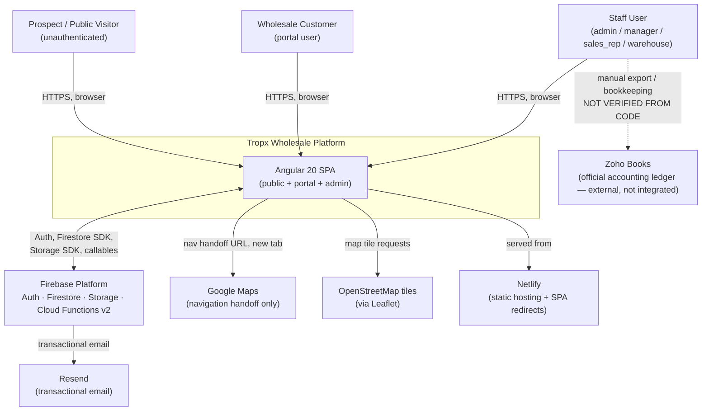

**External actors:**

| Actor | Role |
|---|---|
| Staff (`admin`/`manager`/`sales_rep`/`warehouse`) | Operate the back-office: orders, customers, products, purchasing, field ops, dashboards |
| Wholesale customer (`customer` role) | Self-service catalog browsing, ordering, payment history, returns |
| Prospect / public visitor | Marketing site, request-access, login, forgot-password — no auth required |

**External systems:**

| System | Relationship |
|---|---|
| Firebase (Auth, Firestore, Storage, Cloud Functions v2) | Sole backend — no separate API server |
| Resend | Outbound transactional email only, invoked from Cloud Functions with a secret key |
| Google Maps | One-way navigation handoff (deep link), never an inbound integration |
| OpenStreetMap | Map tile source for the Leaflet-based field map/route planner |
| Netlify | Static hosting + SPA rewrite (`src/_redirects`) — not Firebase Hosting |
| Zoho Books | Referenced throughout the codebase/commits as the system of record for accounting; **no code-level integration exists** — this is a documented boundary, not a built connector |

---

## 4. Container View (C4 Level 2)

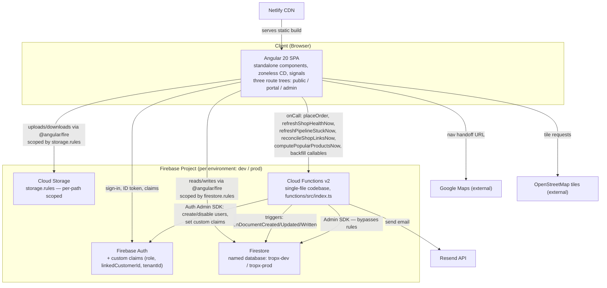

**Container responsibilities:**

| Container | Responsibility | Notes |
|---|---|---|
| Angular SPA | All UI, all client-side business logic (route optimization, cart, form validation, CSV export, invoice/PDF generation via `html2pdf.js`) | Zoneless change detection; no NgModules; `loadComponent()` lazy routes throughout |
| Firebase Auth | Identity + custom claims (`role`, `linkedCustomerId`, `tenantId`) | Claims are the sole authorization signal in security rules — **not** the Firestore profile document |
| Firestore (named DB) | System of record for all business data | Two logical databases per project (`tropx-dev`, `tropx-prod`), not the Firestore `(default)` database |
| Cloud Storage | Binary assets: product/category/brand/logo images, storefront banners/gallery, expense receipts, avatars | Deny-by-default with explicit per-path rules (§9) |
| Cloud Functions v2 | Server-side transactional writes, reconciliation, stamping sweeps, email dispatch, job-queue consumers | One file, two regions (northeast1 scheduled / northeast2 everything else) |

---

## 5. Component View (C4 Level 3)

Focused on `src/app/core/services/` — the singleton services that
encapsulate business logic and are consumed across `features/admin` and
`features/portal`.

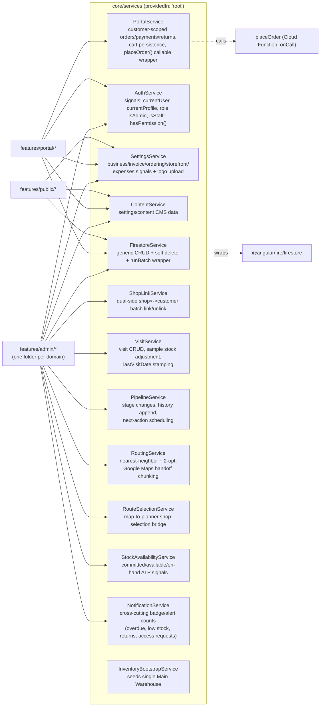

Notable component-level facts:

- `FirestoreService` is a thin wrapper (`getDocument`, `getCollection`,
  `addDocument`, `setDocument`, `updateDocument`, `softDelete`, `runBatch`)
  — hard delete is present in the source only as a commented-out method,
  intentionally unreachable.
- `AuthService` holds two signals that are deliberately desynchronized for
  a moment on every auth change: `currentUser` (Firebase Auth state) and
  `currentProfile` (Firestore `users/{uid}` doc). The profile signal is
  cleared **immediately** on any user change and only repopulated after a
  forced ID-token refresh (`getIdToken(user, true)`), specifically so a new
  custom claim (e.g., `linkedCustomerId` set right after account creation)
  is never missed.
- `StockAvailabilityService` only subscribes to the `orders` collection
  when `AuthService.isStaff()` is true (guarded via `toObservable` +
  `switchMap`) — customers and guests never trigger a read they don't have
  rule-level permission for in the first place.

---

## 6. Deployment Architecture

### 6.1 Requested high-level chain (simplified view)

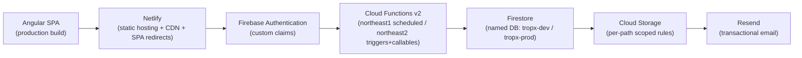

**Read this chain as illustrative, not literal.** In practice the browser
talks to Firestore, Storage, and Auth **directly** via the Firebase Web SDK
for the large majority of reads/writes allowed by `firestore.rules` /
`storage.rules` — Cloud Functions is not a mandatory hop for every request.
The accurate per-path breakdown is the diagram below.

### 6.2 Accurate deployment / traffic view

```mermaid
flowchart TB
    subgraph Browser
        SPA["Angular SPA (from Netlify CDN)"]
    end

    subgraph FBProject["Firebase project: tropx-wholesale-dev / -prod"]
        AuthSvc["Firebase Auth"]
        FSDB["Firestore\n(database: tropx-dev / tropx-prod)"]
        Storage2["Cloud Storage bucket"]
        subgraph FnRegionA["Cloud Functions — northamerica-northeast2"]
            Triggers["Firestore triggers\n(onDocumentCreated/Updated/Written)"]
            Callables["onCall functions\n(placeOrder, refresh*, backfill*)"]
        end
        subgraph FnRegionB["Cloud Functions — northamerica-northeast1"]
            Scheduled["onSchedule functions\n(nightly/weekly sweeps, abandoned cart, popular products)"]
        end
    end

    ResendAPI["Resend API"]
    Netlify2["Netlify (build + CDN)"]

    Netlify2 -->|serves build output| SPA
    SPA -->|sign-in / token refresh| AuthSvc
    SPA -->|direct reads/writes\n(rule-scoped)| FSDB
    SPA -->|direct up/download\n(rule-scoped)| Storage2
    SPA -->|HTTPS callable| Callables

    FSDB -->|document write events| Triggers
    Triggers -->|Admin SDK writes| FSDB
    Triggers -->|send| ResendAPI
    Triggers -->|manage users/claims| AuthSvc

    Scheduled -->|batched Admin SDK reads/writes| FSDB
    Scheduled -->|send summary email| ResendAPI

    Callables -->|Admin SDK transaction| FSDB
```

### 6.3 Environment separation

| | Dev | Prod |
|---|---|---|
| Firebase project | (default alias) | `tropx-wholesale-prod` |
| Firestore database ID | `tropx-dev` | `tropx-prod` |
| Config file | `firebase.json` | `firebase.prod.json` (via `--config` flag) |
| Angular environment | `environment.ts` (`envLabel: 'development'`) | `environment.prod.ts` (`envLabel: 'production'`, via `angular.json` `fileReplacements`) |
| Angular build config | `dev-deploy` (via `npm run build:dev-deploy`) — production optimizations, no `fileReplacements` | `production` (default `ng build`) |
| Frontend hosting | Firebase Hosting, `hosting.site: tropx-wholesale-dev` in `firebase.json` | Netlify (`tropxwholesale.ca`) — prod's Firebase Hosting site exists but has nothing deployed to it |
| Secrets | Separate `RESEND_API_KEY` | Separate `RESEND_API_KEY` |

`DATABASE_ID` in `functions/src/index.ts` resolves at runtime from
`GCLOUD_PROJECT` — the same compiled function artifact runs correctly
against either database with zero code change per environment. This was
not always true; see [ADR-009](#adr-009-resolve-firestore-database-id-at-runtime).

---

## 7. Data Architecture

### 7.1 Entity-Relationship — Commerce & Field Operations

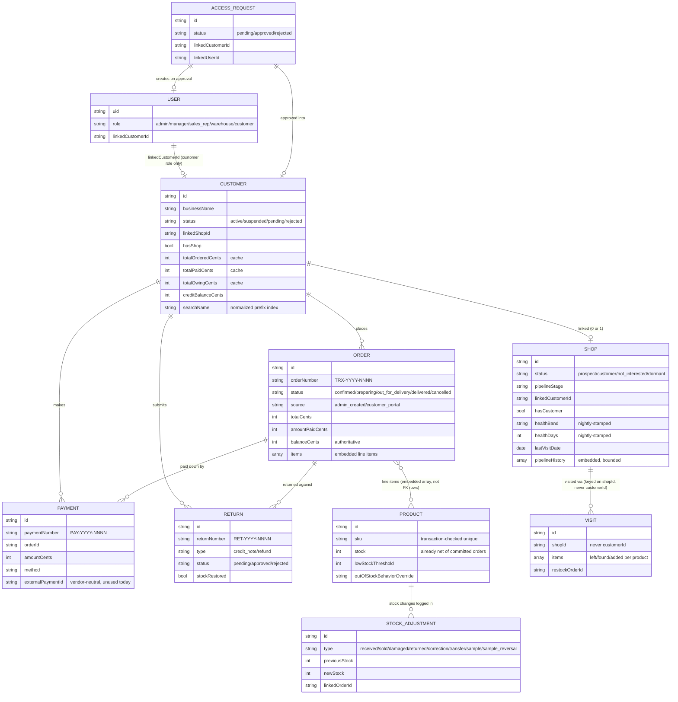

### 7.2 Entity-Relationship — Purchasing & Money-Out

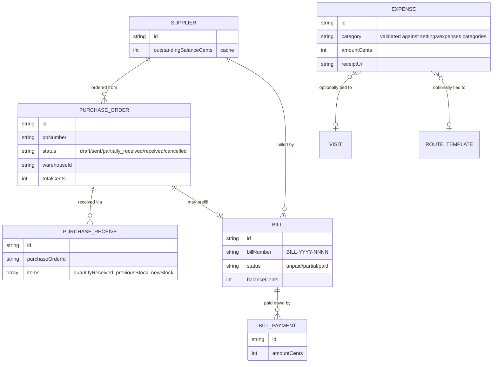

> Firestore is a document database — `items[]` on `Order`/`PurchaseOrder`/
> `PurchaseReceive`/`Visit` and `pipelineHistory[]` on `Shop` are **embedded
> arrays inside the parent document**, not normalized rows in a separate
> table. The ER notation above represents them as relationships purely for
> conceptual clarity; there is no `order_items` collection.

### 7.3 Source of truth vs. cache

| Cached field | Recomputed from | Recompute function |
|---|---|---|
| `customer.totalOrderedCents/totalPaidCents/totalOwingCents` | `orders` + `payments` (source of truth) | `recomputeCustomerCounters()` — shared by real-time triggers and both sweeps |
| `shop.healthBand/healthDays/healthKind` | `order.lastOrderAt` (customers) / `visit.visitDate` (prospects) | `nightlyShopHealthStamp` / `refreshShopHealthNow` |
| `shop.pipelineStuck/daysInStage` | `pipelineEnteredStageAt` vs. per-stage threshold | `nightlyPipelineStuckStamp` / `refreshPipelineStuckNow` |
| `shop.hasCustomer` / `customer.hasShop` | the reciprocal `linkedCustomerId`/`linkedShopId` field | `ShopLinkService` writes + `nightlyLinkReconcile`/`weeklyLinkReconcile` |
| `settings/storefront.popularProducts` | distinct-buyer counts over a configurable window | `computePopularProductsScheduled`/`computePopularProductsNow` |
| `product.stock` | **is itself** the source of truth for ATP (see §8.6) | n/a — decremented transactionally at order confirmation |

### 7.4 Indexing reality vs. stated ambition

`searchName`-normalized fields and server-side pagination are the target
convention for browsable entity lists at this platform's scale, proven
today on `visits` (a composite index on `tenantId, shopId, isDeleted,
visitDate`). Several admin lists (customers, orders) currently sort/filter
**in memory** after a single-field query instead — a known, tracked gap
between the target convention and today's implementation depth, not a
pattern to copy forward. New large lists should follow the indexed/
paginated approach from the start; closing the gap on existing lists is
separate, already-identified roadmap work (§14).

---

## 8. Core Workflows

### 8.1 Authentication & Authorization Flow

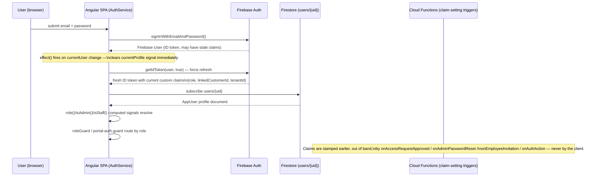

Key invariant: **the custom claim, not the Firestore profile document, is
the authorization signal read by every security rule.** The Firestore
profile is read by the client purely for UI (name, avatar, permissions
list via `ROLE_PERMISSIONS`); a stale profile document cannot grant access
that the claim doesn't already allow, because rules never read
`users/{uid}` to make a decision.

### 8.2 Order Lifecycle

**8.2.1 Status state machine**

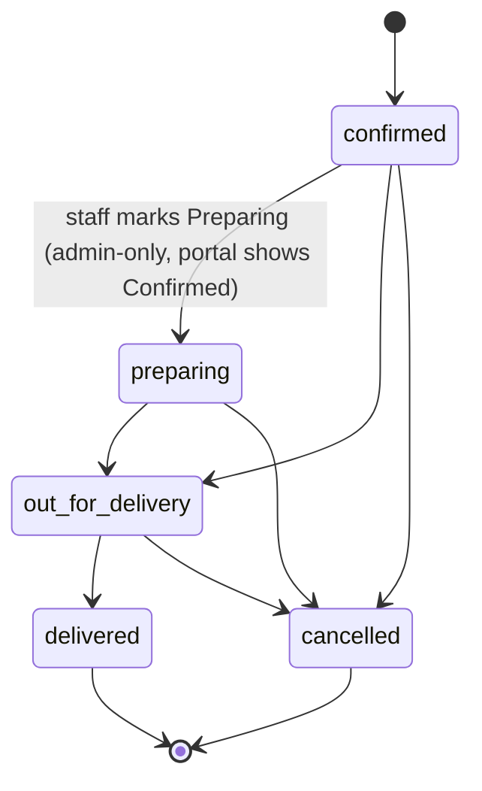

`preparing` is admin-only vocabulary — the portal UI masks it back to
"Confirmed" for the customer in every surface (`portal-orders`,
`portal-order-detail`, `portal-dashboard`), a rule enforced after a bug
where the dashboard briefly leaked the internal status.

**8.2.2 Portal placement — server-side transaction**

```mermaid
sequenceDiagram
    participant C as Portal client
    participant F as placeOrder (onCall, northeast2)
    participant DB as Firestore (transaction)

    C->>F: items[], deliveryType, notes (ID token w/ role=customer, linkedCustomerId)
    F->>F: verify role=customer AND linkedCustomerId present
    F->>DB: tx.get(customer, settings/ordering, settings/orderSequence, each product)
    Note over F: all reads before any write — Firestore transaction rule
    F->>F: compute totals; re-check stock (oversell guard);\napply per-product/global outOfStockBehavior
    F->>DB: tx.set(orders/{new}) status=confirmed, source=customer_portal
    F->>DB: tx.update(customers/{id}) totals +=, lastOrderAt
    F->>DB: tx.set(settings/orderSequence) increment TRX-YYYY-NNNN
    F->>DB: tx.update(products/{id}) stock = max(0, stock - qty) per line
    F->>DB: tx.set(stockAdjustments/{new}) type=sold per line
    DB-->>F: commit — all or nothing
    F-->>C: {orderId, orderNumber, hasBackorder, totalBackorderedUnits}
    DB-->>DB: onOrderWriteReconcile fires (real-time reconciliation)
```

Admin-created orders follow an equivalent shape (order + stock + counters
in one write) but through a client-side `FirestoreService.runBatch()`
rather than a callable — staff writes are already trusted by
`firestore.rules`, so the extra transactional indirection is unnecessary
for that path.

### 8.3 Shop Lifecycle (prospect → customer)

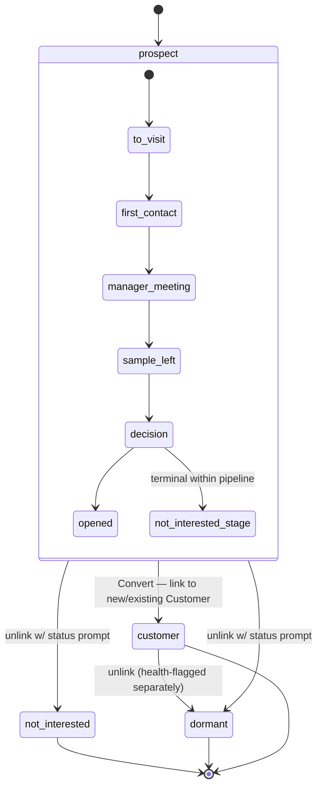

Conversion sets `shop.linkedCustomerId` / `customer.linkedShopId` and both
`hasShop`/`hasCustomer` flags in one dual-side batch (`ShopLinkService`) —
no data migration, because `Visit` documents are keyed on `shopId` and
therefore already belong to the (now-linked) shop regardless of conversion
timing.

### 8.4 Route Planning Flow

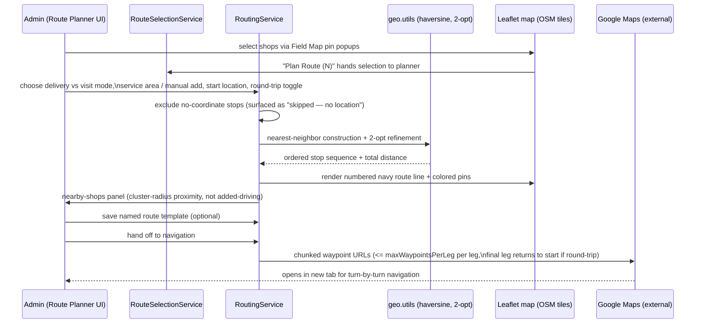

### 8.5 Purchase Order Lifecycle

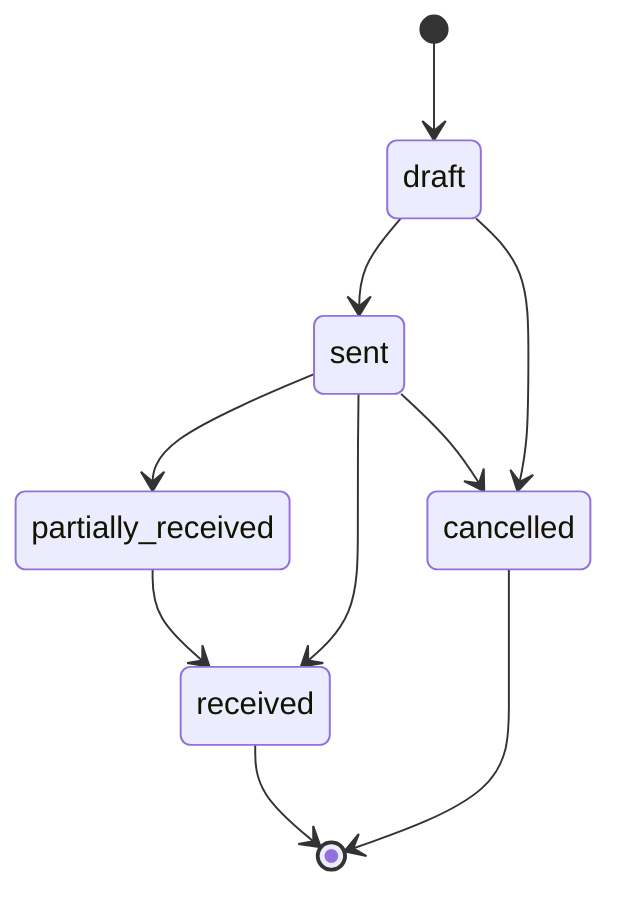

```mermaid
sequenceDiagram
    participant A as Admin
    participant PO as PurchaseOrder doc
    participant PR as PurchaseReceive doc
    participant P as Product doc
    participant B as Bill doc
    participant CF as onPoRequest (Cloud Function)

    A->>PO: create PO (draft), add line items, set warehouseId
    A->>CF: "Send" writes poRequests/{id}
    CF->>CF: render PO PDF, email supplier via Resend
    CF-->>PO: stamp sentAt, status=sent
    A->>PR: Goods Receipt — batch stock-in against PO
    PR->>P: update stock (previousStock -> newStock) per item
    PR->>PO: update quantityReceived per line,\nstatus -> partially_received or received
    A->>B: "Create Bill" on PO detail — prefills Bill from PO
    Note over B: Bill/BillPayment are operational tracking only;\nZoho Books remains the ledger of record.
```

### 8.6 Inventory / Stock Lifecycle

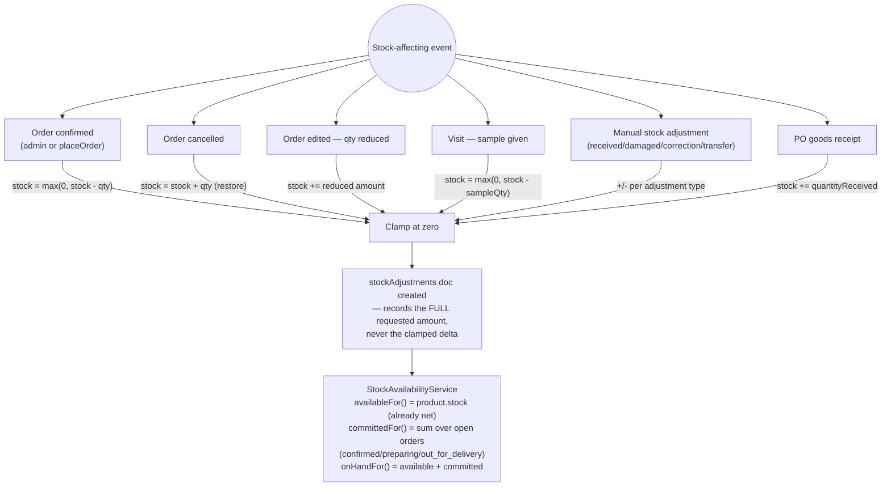

The clamp-vs-audit-record divergence in the diagram above is deliberate,
not an inconsistency: the counter must never go negative (it feeds ATP and
low-stock alerts), but the audit trail must show what actually happened,
including real oversell events.

### 8.7 Notification Flow

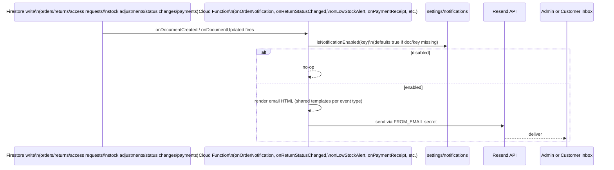

The abandoned-cart variant (`checkAbandonedCarts`, scheduled) adds
per-threshold state on the cart document itself
(`abandonedEmailSent24h/72h/7d`) so a threshold never re-sends, and clears
all three flags when the cart converts to an order.

`onContactInquiry` and `onAccessRequestNotification` hang off
unauthenticated public-create collections (`contactInquiries`/
`accessRequests`, `create: if true` in `firestore.rules`) and add a second
gate before the `isNotificationEnabled` check: `isRateLimited(scope,
email)`, keyed by a sha256 hash of the submitter's email in
`rateLimitCounters/{hash}` (a Cloud-Functions-only collection, staff
read-only in `firestore.rules`), config-driven via `settings/rateLimits`.
This exists because Firestore rules can't see IP address or request
velocity — the request document still gets created either way, but an
over-limit submission stamps `rateLimited: true` and returns before ever
reaching Resend.

`sendPasswordResetEmail` does **not** use this pattern — an email-keyed
limiter on password reset lets an attacker who doesn't own the victim's
inbox lock the victim out of their own reset attempts by burning the
victim's own limit. Instead, `passwordResetRequests` denies public
`create` entirely; the only writer is `requestPasswordReset` (`onCall`),
which rate-limits by a hash of `request.rawRequest.ip` — real requester
signal only a callable exposes, unlike a Firestore trigger — before
writing the request doc itself via the Admin SDK. See the `isRateLimited`
comment block in `functions/src/index.ts` and ARCHITECTURE.md §6.5 for the
full incident/fix writeup, including the accepted residual risk around
per-identifier counter-doc growth (mitigated by App Check's score-based
rejection plus a Firestore TTL policy on `rateLimitCounters.expiresAt`,
not eliminated). See `functions/src/rate-limit.spec.ts`.

### 8.8 Cloud Function Interaction Map

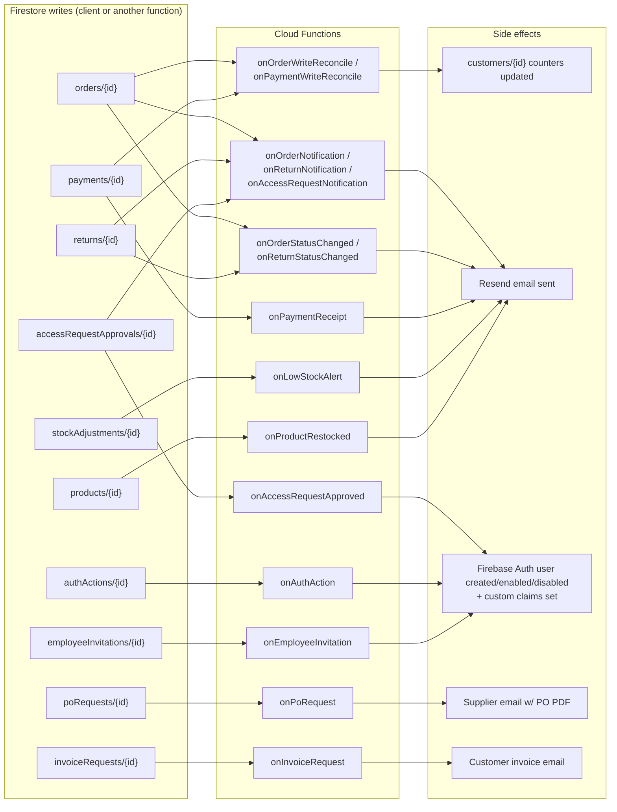

### 8.9 Scheduled Jobs

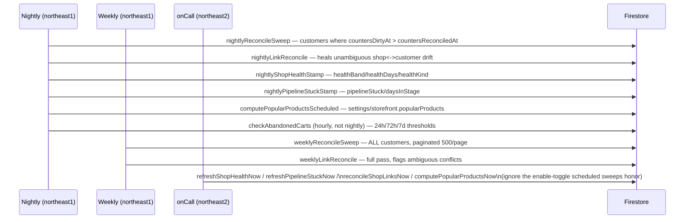

Every sweep and its on-demand twin call the **same underlying recompute
function** — this is what makes re-running a sweep safe (idempotent) and
is verified, per project testing philosophy, by running a sweep twice and
asserting no second-pass change (**testing philosophy documented in
CLAUDE.md — actual automated test coverage for this is `NOT VERIFIED FROM
CODE`; see §10.7**).

### 8.10 Customer Portal Request Flow

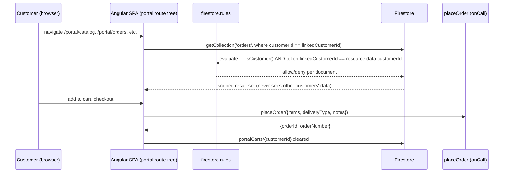

Every direct-write path available to a customer (own cart, own return
submission) is scoped the same way: by the `linkedCustomerId` custom
claim, never by comparing a Firestore document ID to the Auth UID (see
[ADR-008](#adr-008-scope-customer-access-by-linkedcustomerid-claim-not-uid)).

### 8.11 Admin Request Flow

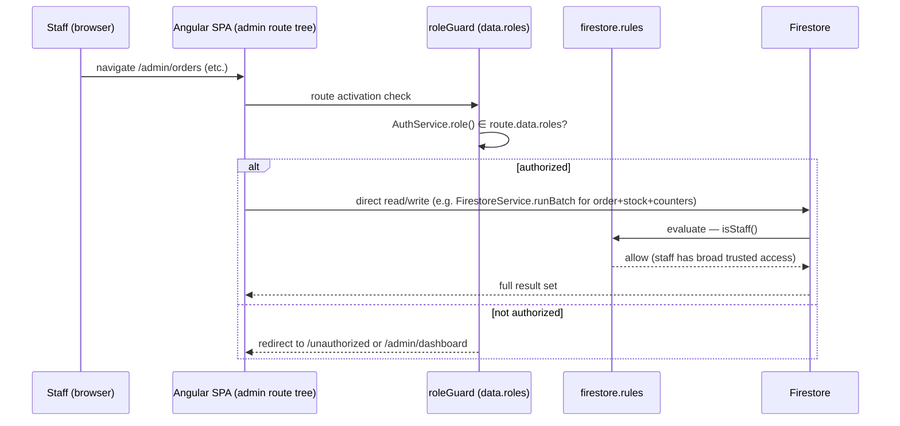

The admin path is **direct client writes under a trust boundary** (staff
role), in contrast to the portal path, which is **funneled through a
server-side transaction** for anything financially or inventory
consequential. This asymmetry is intentional: staff are an internal trust
boundary; customers are not.

---

## 9. Security Architecture

### 9.1 Trust model

```mermaid
flowchart TD
    subgraph Untrusted["Untrusted"]
        Guest["Unauthenticated visitor"]
        CustClient["Customer's browser/session"]
    end
    subgraph Trusted["Trusted (staff)"]
        StaffClient["Staff browser/session"]
    end
    subgraph Enforced["Enforcement points"]
        Rules2["firestore.rules / storage.rules\n(custom-claim based)"]
        ServerFn["Server-side transactional functions\n(placeOrder, stamping sweeps,\nreconciliation)"]
    end

    Guest -->|create-only: accessRequests,\ncontactInquiries| Rules2
    Guest -->|requestPasswordReset\n(onCall, IP-rate-limited)| ServerFn
    CustClient -->|read/create own orders/returns,\nread own payments, own cart| Rules2
    CustClient -->|checkout| ServerFn
    StaffClient -->|full read/write on operational collections| Rules2
```

### 9.2 Authorization mechanics

- **Custom claims, not profile documents.** `request.auth.token.role` and
  `request.auth.token.linkedCustomerId` are the only signals rules read.
  Claims are stamped exclusively by Cloud Functions
  (`onAccessRequestApproved`, `onAdminPasswordReset`, `onEmployeeInvitation`,
  `onAuthAction`), never by the client.
- **Force token refresh after claim changes** (`getIdToken(user, true)`) —
  necessary because ID tokens cache claims for their lifetime; a claim
  change without a forced refresh is invisible to the client until the
  token naturally expires.
- **Role table:**

  | Role | Firestore access | Notes |
  |---|---|---|
  | `admin` | Full access, plus `reconciliationLog` and `employeeInvitations` (admin-only, narrower than general staff) | |
  | `manager` / `sales_rep` / `warehouse` | Full read/write on orders, payments, returns, customers, stockAdjustments, shops, visits, purchasing, expenses/bills | Collectively "staff" |
  | `customer` | Read/create own `orders`/`returns`, read own `payments`, own `portalCarts` doc; `update` own `customers` record through a narrow field allowlist (business name, owner name, phone, address, logo) | Scoped by `linkedCustomerId` claim, not UID; money/status/link fields on the customer doc stay staff-only even for the owning customer |
  | unauthenticated | `create`-only: `accessRequests`, `contactInquiries`, `bannerClicks`; public read: `products`, `categories`, `brands`, `serviceAreas`, storefront-facing `settings` docs | `passwordResetRequests` denies public `create` — reached only via the IP-rate-limited `requestPasswordReset` onCall (§8.7, §9.2 diagram) |

- **Fallback-deny-by-default** on both `firestore.rules`
  (`match /{document=**} { allow read, write: if false; }`) and
  `storage.rules` (`match /{allPaths=**} { allow read, write: if false; }`)
  — any newly added collection or Storage path is unreachable until an
  explicit rule is written for it. `firestore.rules`'s fallback read
  `isStaff()` instead of `false` until Phase 3.5 (2026-07-30) — see §9.3
  for why that was a real bug, not just a stricter-than-necessary default.

### 9.3 Real historical bugs, corrected

**Bug 1 — `customerId == request.auth.uid`.** An earlier `firestore.rules`
revision scoped customer access by comparing `customerId ==
request.auth.uid`. This **never matched**, because `customerId` is a
Firestore document ID, not the customer's Firebase Auth UID — an easy
mistake to make, and one worth remembering precisely because it fails
*closed* (over-restrictive, not a leak) but silently breaks legitimate
customer access. The fix — scoping through the `linkedCustomerId` custom
claim — is now the standing pattern for every customer-scoped rule.

**Bug 2 — the fallback rule silently overrode narrower rules (found by
Phase 3.5, fixed 2026-07-30).** Firestore evaluates every `match` block
whose path applies to a request and grants access if *any* of them
allows it — matches are OR'd, not first-match-wins. The fallback
`match /{document=**} { allow read, write: if isStaff(); }` therefore
matched every document at every depth, including ones already governed
by a stricter rule above it. In practice this meant any staff role (not
just admin) could read/write `reconciliationLog` and
`employeeInvitations` despite their `isAdmin()` guard, and any staff
member could hard-delete `orders`/`returns` despite `allow delete: if
false` — a direct violation of the soft-delete-only invariant (§5). This
fails *open* (a leak, not over-restriction) — the more dangerous
direction of the two bugs in this section — and went unnoticed because
nothing had ever exercised it: no test asserted the admin-only or
delete-denial rules against an actual non-admin-staff or delete
request. Caught by the Phase 3.5 rules-unit-testing suite
(`functions/src/firestore-rules.spec.ts`), which asserts the per-role
matrix against the real rules file rather than trusting the rule
author's stated intent. Fixed by narrowing the fallback to `if false`;
a full-codebase grep of every collection name referenced in `src/` and
`functions/src/index.ts` (including every Cloud Functions trigger)
confirmed every real collection already has its own explicit rule, so
the change is deny-only for genuinely unlisted paths — nothing in
production relied on the permissive fallback. **Lesson: a
recursive-wildcard fallback rule is never "just" a safety net for
unlisted collections — it silently participates in every other rule's
decision for every path. Never make it more permissive than the single
most-restrictive rule anywhere else in the file; `if false` is the only
fallback that can't undermine something else.**

### 9.4 Storage rules

Cloud Storage follows the same deny-by-default, custom-claim-scoped design
as Firestore: every path is unreachable unless an explicit rule grants it,
using the identical `isStaff()`/`isCustomer()` functions. Public read is
granted only to genuinely public storefront assets; everything else is
staff-only or staff-or-owning-customer, with financial documents (expense
receipts) never publicly readable.

| Path prefix | Read | Write |
|---|---|---|
| `settings/`, `products/`, `categories/`, `brands/`, `storefront/`, `content/` | public | staff only |
| `customers/{customerId}/` (business logo) | staff, or that customer via `linkedCustomerId` claim | same |
| `userProfiles/{uid}/` (staff avatar) | staff | staff, own `uid` only |
| `expenses/receipts/` | staff only | staff only |
| anything else | deny | deny |

---

## 10. Quality Attributes

### 10.1 Availability

Firebase-managed services (Firestore, Auth, Storage, Cloud Functions) carry
Google's own SLAs; the application layer adds no additional redundancy
(no multi-region Firestore, no function retries beyond the platform
default). Netlify's CDN provides static-asset availability independent of
Firebase's health. **Single points of failure:** the single Cloud Functions
codebase/deployment unit (a bad deploy affects every function
simultaneously) and the single Firestore database per environment (no
sharding). This is an acceptable trade-off, not an oversight: Firestore's
per-project database already provides Google-managed horizontal scaling —
logical multi-tenancy via `tenantId` doesn't require a physically sharded
database — and the single Cloud Functions deployment unit's real cost is
deploy blast radius and long-term maintainability (tracked in §14), not
throughput. See §11.

### 10.2 Reliability

Reliability is engineered primarily through **idempotency and
self-healing sweeps** rather than transactional guarantees alone:
real-time reconciliation triggers keep counters fresh, but a nightly and a
weekly sweep independently re-derive the same truth from source documents,
so a missed or failed trigger self-corrects within 24 hours at most. The
same self-healing pattern covers the shop↔customer link
(`nightlyLinkReconcile`/`weeklyLinkReconcile`) and shop
health/pipeline-stuck stamps. Every multi-document write that must succeed
or fail as a unit uses `runBatch()` (client) or a Firestore transaction
(`placeOrder`), eliminating a large class of partial-write reliability
bugs by construction.

### 10.3 Maintainability

Strong: config-driven UI (`core/config/*.config.ts`), one folder per admin
domain, standalone components with no NgModule boilerplate, a documented
and (mostly) followed convention set in `CLAUDE.md`. Weak spot: **all
Cloud Functions logic lives in one ~5,600-line file**
(`functions/src/index.ts`) rather than split by domain — every function
shares module scope, secrets, and imports, which is simple to reason about
today but will become a real maintainability cost as function count grows
further (see §14).

### 10.4 Security

Covered in depth in §9. Summary: custom-claim-based authorization,
deny-by-default fallback rules on both Firestore and Storage, and a
narrow, auditable set of server-side transactional entry points for
anything money- or inventory-consequential.

### 10.5 Scalability

The architecture's central bet: **stamp once, read many** for every
list/dashboard-surfaced derived value (§7.3), so list rendering stays a
single indexed query regardless of store count. The gap between this
stated pattern and the current `firestore.indexes.json` (§7.4) is the
most important scalability risk to track — the pattern is proven (visits),
but not yet applied everywhere the documented convention says it should
be. Route optimization and cart/catalog logic are deliberately client-side,
which scales with the number of *concurrent users*, not the number of
*stores*, and therefore doesn't threaten backend scalability the way an
unindexed list query would.

### 10.6 Performance

Money math is integer-cents throughout (no floating-point rounding cost or
correctness risk). Stamped fields mean dashboard loads do not fan out into
N per-row reads. Client-side PDF generation (`html2pdf.js`) and route
optimization (nearest-neighbor + 2-opt) run in the browser, trading a
small amount of client CPU time for zero backend load and zero API cost —
appropriate given expected per-session data sizes (a route is at most a
day's worth of stops, not 1000 shops at once).

### 10.7 Testability

The project's testing philosophy is already precisely specified (exact
integer-cent assertions, stock-clamp invariants, dual-run idempotency
checks against the Firebase emulators, per-role rules testing) — this
document treats that specification as the design target. Test file
coverage against that target, and a CI pipeline to run it, are the
leading roadmap items for hardening this architecture (§14): the
specification exists and is precise; building the suite it describes is
the concrete next step.

### 10.8 Observability

Cloud Functions log via `console.log`/`console.error`, visible in Firebase
Console / `firebase functions:log` — there is no structured logging,
tracing, or external APM integration (Sentry, Datadog, etc.) **verified in
code**. Notification failures degrade silently by design in some paths
(e.g., `getAdminEmail()` falls back to a hardcoded address on read
failure rather than throwing), which favors availability of the
notification path over surfacing the underlying error loudly. No
dashboards or alerting beyond the in-app admin notification bell and
reconciliation-log/email summaries were found in the codebase.

---

## 11. Architectural Trade-offs

| Trade-off | Choice made | What was given up |
|---|---|---|
| Denormalized counters vs. live aggregation | Stamp nightly/real-time, read a field | Slight staleness window (bounded by real-time triggers + nightly/weekly sweep) in exchange for O(1) list reads at any store count |
| Single Cloud Functions file vs. modularized codebase | One file | Simplicity and a single deploy unit today, at the cost of growing merge-conflict and comprehension surface as the file continues to grow |
| Client-side route optimization vs. a routing API | Free, unlimited, in-browser nearest-neighbor + 2-opt | A less globally-optimal route than a dedicated solver might produce, accepted because Google's free consumer nav already caps waypoints, making perfect optimization moot beyond a point |
| Portal writes funneled through `placeOrder` vs. direct client writes | Server-side transaction, oversell re-check, atomic stock+counters | Slightly more latency and an extra network hop per checkout, in exchange for closing a real trust gap (client-authored orders bypassing stock/price checks) |
| Firestore rules/claims as the only authorization layer vs. a dedicated API gateway | No separate backend service | Every access-control change is a rules-file edit with global blast radius (see §9.2) rather than isolated to one service's code |
| Zoho Books as ledger vs. building accounting in-portal | Portal owns operations only | Slower path to full self-sufficiency, but avoids building tax-invoice numbering and HST-return generation prematurely — explicitly deferred, not abandoned |
| `pipelineHistory[]` as an append-only array vs. a subcollection | Embedded array on the shop doc | A real document-size ceiling, not a theoretical one — the array logs every stage transition (not deduped per stage), so a shop that bounces between stages repeatedly keeps growing it. Distant in the common case (a prospect passes through a handful of transitions), but unbounded in principle; a cap or archive-on-overflow is the mitigation if a shop's history ever approaches the limit. In exchange: one-read access to the full stage timeline for the UI and the avg-convert KPI |

---

## 12. Operational Considerations

- **Dev-before-prod discipline**: feature branches deploy/verify against
  the dev Firebase project before `master` (which auto-deploys) receives
  the merge.
- **`fileReplacements` is load-bearing**: `angular.json`'s production
  build config must swap `environment.ts` → `environment.prod.ts` or a
  "production" build silently ships dev Firebase config — this broke once
  in production history and is now fixed, but is a one-line regression
  risk on any future environment-config change.
- **Region split is mandatory, not stylistic**: `onSchedule` functions
  must run in `northamerica-northeast1`; every Firestore trigger/`onCall`
  runs in `northamerica-northeast2` — Cloud Scheduler does not support
  `northeast2`.
- **First-time 2nd-gen deploy to a new GCP project** needs one-time IAM
  grants (`roles/cloudbuild.builds.builder` on the Cloud Build service
  account; Artifact Registry Editor/Writer on the compute service
  account) and tolerates an Eventarc permission-propagation delay of a few
  minutes.
- **A failed function deploy can strand a function as an HTTPS
  placeholder** with the wrong trigger type — recovery requires
  delete-and-recreate, not a normal redeploy.
- **Secrets are per-project** (`RESEND_API_KEY`, `FROM_EMAIL` via Cloud
  Secret Manager) — dev and prod do not share a key.
- **No CI pipeline exists in-repo** (`NOT VERIFIED FROM CODE` beyond
  confirming absence of `.github/workflows` and `netlify.toml`) — Netlify
  build configuration and Firebase deploys are Not Verified as automated;
  treat as dashboard/manual until confirmed otherwise.

---

## 13. Architecture Decision Records

Lightweight ADRs reconstructed from commit history and current code. Each
is `Accepted` and currently in effect unless noted otherwise.

#### ADR-001: Shop as a first-class entity, separate from Customer
**Context:** Prospects need visit history before they have a portal
account. **Decision:** Model `Shop` independently from `Customer`, linked
symmetrically once conversion happens. **Consequences:** Conversion is a
link-attach, not a data migration. **Rejected alternative:** Tying visits
to `customerId` directly.

#### ADR-002: Visits keyed on `shopId`, never `customerId`
**Context:** Same as ADR-001. **Decision:** `Visit.shopId` is the only
foreign key; no `customerId` field exists on `Visit`. **Consequences:** All
visit history survives conversion automatically. **Status:** Considered
foundational — do not add a `customerId` to `Visit`.

#### ADR-003: `pipelineHistory` as a bounded embedded array, not a subcollection
**Context:** A prospect passes through a handful of pipeline stages total.
**Decision:** Store history as an array on the `Shop` document.
**Consequences:** One document read powers both the stage timeline and the
avg-days-to-convert KPI. **Rejected alternative:** A `pipelineHistory`
subcollection — rejected as unnecessary cross-loads for no benefit in the
common case. The array is append-only (every stage transition logs an
entry, not deduped per stage), so the document-size ceiling this trades
against is real, if distant in practice; see §11 for the mitigation if a
shop's history ever approaches it.

#### ADR-004: Stamp shop health and pipeline-stuck status nightly, server-side
**Context:** Computing "days since last order/visit" per row does not
scale to 1000+ stores on every list/dashboard render. **Decision:**
Nightly scheduled functions stamp `healthBand`/`healthDays`/`pipelineStuck`
onto each `Shop` document; on-demand `onCall` twins exist for immediate
recompute and deliberately ignore the enable-toggle the scheduled jobs
honor. **Consequences:** Lists and dashboards read a plain field.

#### ADR-005: Vendor-neutral payment field names
**Context:** No payment processor is integrated yet, but the schema needs
to anticipate one. **Decision:** `externalPaymentId`,
`externalPaymentProvider`, `externalEventId` (Payment),
`externalPaymentCustomerId` (Customer) — none of them processor-specific.
**Consequences:** Integrating any processor later (Stripe, Square, PayPal)
requires no field rename. **Rejected alternative:** Stripe-specific field
names.

#### ADR-006: Zoho Books remains the accounting ledger; portal owns operations only
**Context:** Full self-sufficiency is a long-term goal, but official
tax-invoice numbering and CRA HST-return generation is "the hard last
mile." **Decision:** `Bill`/`Expense`/`BillPayment` are explicitly
operational tracking, not double-entry accounting. **Status:** Deliberate,
ongoing boundary — not a gap to be silently closed.

#### ADR-007: Client-side route optimization; Google Maps for navigation only
**Context:** Google's paid routing/optimization APIs cost money at scale;
its free consumer navigation caps around 9 waypoints per request.
**Decision:** Nearest-neighbor + 2-opt runs client-side
(`geo.utils`/`RoutingService`), with a chunked-legs handoff to Google Maps
for turn-by-turn navigation only. **Consequences:** Optimization is free
and unlimited; multi-leg navigation requires the chunking logic.
**Rejected alternative:** Paid Google Directions/Optimization APIs.

#### ADR-008: Scope customer access by `linkedCustomerId` claim, not UID
**Context:** An earlier rules revision compared
`customerId == request.auth.uid`, which never matched because
`customerId` is a Firestore document ID. **Decision:** Every
customer-scoped rule compares `resource.data.customerId` (or equivalent)
against `request.auth.token.linkedCustomerId`. **Status:** Corrected and
now the standing pattern for all customer-facing rules.

#### ADR-009: Resolve Firestore database ID at runtime from `GCLOUD_PROJECT`
**Context:** `"tropx-dev"` was hardcoded in 16 separate locations in
`functions/src/index.ts`, meaning the same compiled artifact could never
correctly target `tropx-prod`. **Decision:**
`const DATABASE_ID = PROJECT_ID === "tropx-wholesale-prod" ? "tropx-prod" : "tropx-dev"`,
computed once from `process.env.GCLOUD_PROJECT`. **Consequences:** One
build artifact is deployable to either environment unmodified.

#### ADR-010: `placeOrder` as a server-side transactional `onCall`, replacing a client-side batch write
**Context:** The original portal launch placed orders via
`PortalService.placeOrder()` executing a client-side `writeBatch()` —
trusting the client to compute totals, re-check stock, and write
`stockAdjustments` correctly. **Decision:** Move the entire operation into
a Cloud Function transaction that independently re-verifies stock,
re-derives totals from server-read product prices, and performs all
writes atomically. **Consequences:** Closes a real trust gap; adds one
network hop per checkout. See §8.2.2.

#### ADR-011: Scheduled functions in `northamerica-northeast1`; everything else in `northamerica-northeast2`
**Context:** Cloud Scheduler — the mechanism `onSchedule` functions run
on — does not support `northamerica-northeast2` as a valid location.
**Decision:** Split by trigger type, not by convenience. **Consequences:**
Two regions to remember when adding any new function; documented
explicitly to prevent recurrence.

#### ADR-012: Per-card `editing` signal and independent save on every settings page
**Context:** A single shared `editing` signal put every settings card
into edit mode simultaneously. **Decision:** Each settings card owns its
own `editing*` signal, its own save/cancel methods, and calls
`updateDocument` (partial merge) rather than `setDocument`, so saving one
card never clobbers another card's fields on the same document.
**Status:** Now the standing convention for all settings UI.

#### ADR-013: `outOfStockBehavior` — global setting + per-product override, resolved through one helper
**Context:** An earlier plain boolean `allowBackorder` could not express
"hide," "show disabled," and "allow backorder" as distinct states, nor a
per-product exception. **Decision:** A three-way enum at
`settings/ordering.outOfStockBehavior`, overridable per product via
`product.outOfStockBehaviorOverride`, resolved everywhere through a single
helper rather than read ad hoc. **Consequences:** Stock-display logic
never has two divergent implementations of the same rule.

#### ADR-014: "Nearby shops" on the route planner reports proximity, not added-driving
**Context:** A true "how much extra driving would adding this stop cost"
figure requires re-optimize-with-insertion geometry. **Decision:** Ship
the honest, simpler metric — "within cluster radius of a route's
shops" — and defer the harder computation. **Status:** Explicitly deferred
in commit history as "a geometry rabbit hole," not abandoned. Do not
relabel the existing metric to imply it measures added driving distance
without doing the actual computation.

#### ADR-015: Storage rules scoped per-path, mirroring Firestore's claim-based model
**Context:** Cloud Storage needed the same staff/customer trust boundary
already established in Firestore, applied consistently across every
upload path in the app (logos, product/category/brand images, storefront
banners/gallery, expense receipts, avatars). **Decision:** Explicit
per-path rules using the same `isStaff()`/`isCustomer()` custom claim
functions already used in `firestore.rules` (§9.4), with a deny-by-default
fallback for anything not explicitly listed. **Consequences:** Any new
Storage upload feature needs its own scoped rule before it will work —
this is treated as a feature of the design (nothing is reachable by
accident), not friction.

---

## 14. Roadmap & Deliberate Trade-offs

Every item below is a scoped, identified follow-on — not a surprise
discovered late. Mature engineering teams call these out explicitly
rather than let them go unstated; each has a clear next step.

| Item | Status | Detail |
|---|---|---|
| Automated test coverage | Roadmap | A detailed testing philosophy is already documented (exact-cent money assertions, stock-clamp invariants, dual-run idempotency checks against the Firebase emulators, per-role rules testing) — building the corresponding test suite against it is the next step (§10.7) |
| CI/CD pipeline | Not verified from code | No CI configuration was found in-repo; deploys currently follow the documented manual dev-before-prod command sequence |
| Multi-warehouse | Data-model-ready | `warehouseId` already exists on stock documents and a `warehouses` collection is seeded (`InventoryBootstrapService`); activating multi-warehouse fulfillment is a scoped follow-on once `StockAvailabilityService` keys committed stock per warehouse, not a redesign |
| Firestore composite indexing | Roadmap | Proven today on `visits`; extending the same `searchName` + composite-index + server-pagination pattern to the remaining large lists (customers, orders) is planned, deliberate follow-on work (§7.4) |
| Cloud Functions modularization | Roadmap | Splitting the single Cloud Functions file by domain becomes increasingly worthwhile as it grows — a natural next refactor |
| Payment processor integration | Modeled, not yet built | Vendor-neutral schema is already in place (§7.3, ADR-005); wiring an actual processor is the remaining step, with the integration shape already decided |
| `serviceAreaCustom` on `Customer` | Deprecated, retained | Kept for backward compatibility with documents predating `ServiceAreaSelectComponent`; new code treats `serviceAreaId` as primary |
| Route "added-driving" metric | Deliberately deferred | The current nearby-shops panel reports honest cluster proximity; a harder re-optimize-with-insertion metric is a considered future enhancement (ADR-014), not an oversight |
| Direct customer writes to `products`/`stockAdjustments` | Effectively closed | Current rules require staff or a non-null `linkedCustomerId` claim, and `placeOrder` performs the write server-side inside a transaction; confirming no legacy client path bypasses it is a small remaining verification step |

---

## 15. Future Evolution

Grounded strictly in what the codebase and commit history already
anticipate or explicitly defer — not speculative net-new feature ideas.

1. **Multi-warehouse activation** — the data model (`warehouseId`,
   `warehouses` collection, `InventoryBootstrapService`) is already in
   place; the remaining work is keying `StockAvailabilityService`'s
   committed-stock computation by warehouse once orders actually carry a
   `warehouseId`, and building whatever UI lets staff choose a fulfillment
   warehouse.
2. **Payment processor integration** — the vendor-neutral schema and the
   intended flow (processor webhook creates a `Payment` document directly,
   which flows through the existing `onPaymentReceipt` trigger with no new
   email code) are already decided (ADR-005); implementation is the
   remaining step.
3. **Route "added-driving" metric** — replacing the current proximity-only
   nearby-shops signal with a true re-optimize-with-insertion computation,
   explicitly deferred rather than built (ADR-014).
4. **Zoho Books replacement** — the long-term stated goal is for the
   portal to run the entire operation independently. The last identified
   bridge is official tax-invoice numbering integrity and CRA HST-return
   generation, explicitly treated as a separate future track rather than
   something to build incidentally alongside other features.
5. **Cloud Functions modularization** — splitting `functions/src/index.ts`
   by domain (reconciliation, field-ops stamping, notifications, purchasing,
   auth-lifecycle) becomes increasingly worthwhile as the file continues to
   grow.
6. **Closing the indexing gap** — extending the `searchName` +
   composite-index + server-side-pagination pattern (proven on `visits`)
   to the remaining large lists (customers, orders) before store count
   makes in-memory sort/filter a real latency problem.

---

## 16. Appendix — Reference Tables

### 16.1 Cloud Functions by region

| Region | Trigger types | Reason |
|---|---|---|
| `northamerica-northeast2` | Firestore triggers (`onDocumentCreated/Updated/Written`), `onCall` callables | Matches the Firestore database's region |
| `northamerica-northeast1` | `onSchedule` only | Cloud Scheduler does not support `northeast2` |

### 16.2 Role → permission surface (from `AuthService.ROLE_PERMISSIONS`)

| Role | Representative permissions |
|---|---|
| `admin` | `*` (all) |
| `manager` | products, orders, payments, customers, stock adjust, dashboard, reports, approve access, manage shops |
| `sales_rep` | view products, manage orders, record payments, view/add customers, manage shops |
| `warehouse` | view products, manage orders, adjust stock, view customers |
| `customer` | own profile/orders/cart/payments/totals, browse products |

### 16.3 Firestore top-level collections (by subsystem)

| Subsystem | Collections |
|---|---|
| Commerce | `customers`, `orders`, `payments`, `returns`, `products`, `stockAdjustments` |
| Field operations | `shops`, `visits`, `routeTemplates` |
| Purchasing / money-out | `suppliers`, `purchaseOrders`, `purchaseReceives`, `bills`, `billPayments`, `expenses`, `warehouses` |
| Identity / access | `users`, `accessRequests`, `accessRequestApprovals`, `employeeInvitations`, `authActions`, `adminPasswordResets`, `passwordResetRequests` |
| Config-as-data | `settings/{business,invoice,ordering,storefront,content,notifications,reconciliation,expenses,*Sequence}` |
| Job-queue | `invoiceRequests`, `poRequests`, `stockNotificationRequests`, `contactInquiries` |
| Integrity / analytics | `reconciliationLog`, `bannerClicks` |
| Portal-specific | `portalCarts` |

### 16.4 Document numbering sequences

| Prefix | Document type | Sequence doc |
|---|---|---|
| `TRX` | Order | `settings/orderSequence` |
| `PAY` | Payment | `settings/paymentSequence` |
| `RET` | Return | `settings/returnSequence` |
| `BILL` | Bill | `settings/billSequence` |

---

*End of document. For the underlying grounded engineering reference this
document was built from, see `docs/ARCHITECTURE.md`.*
